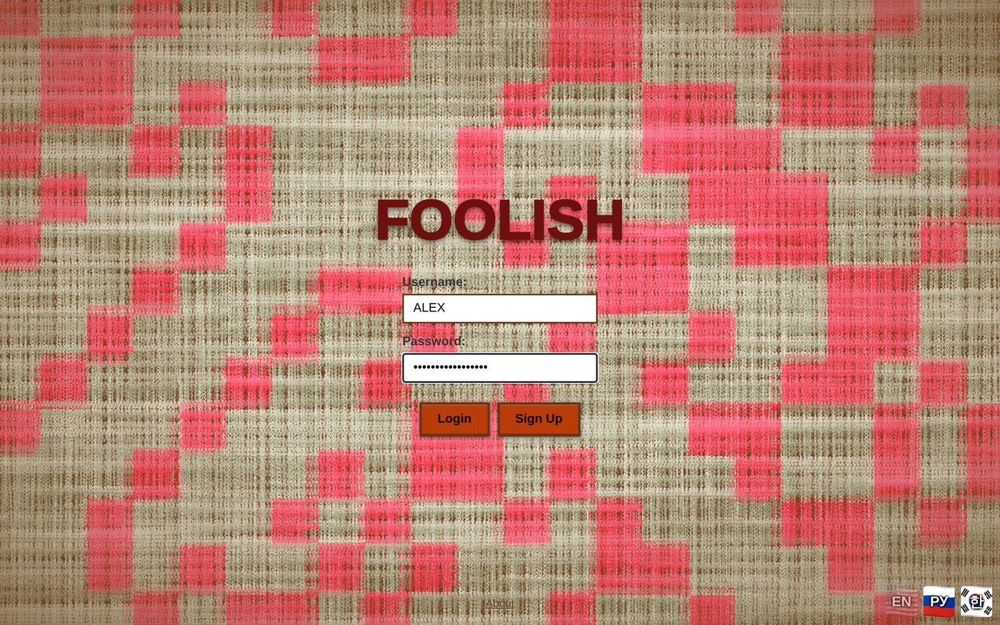
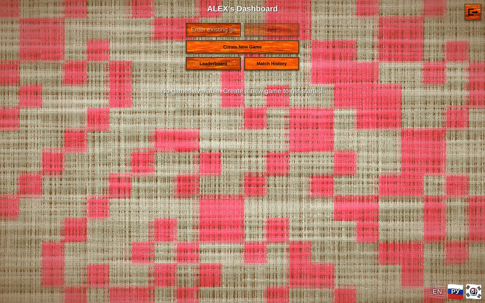
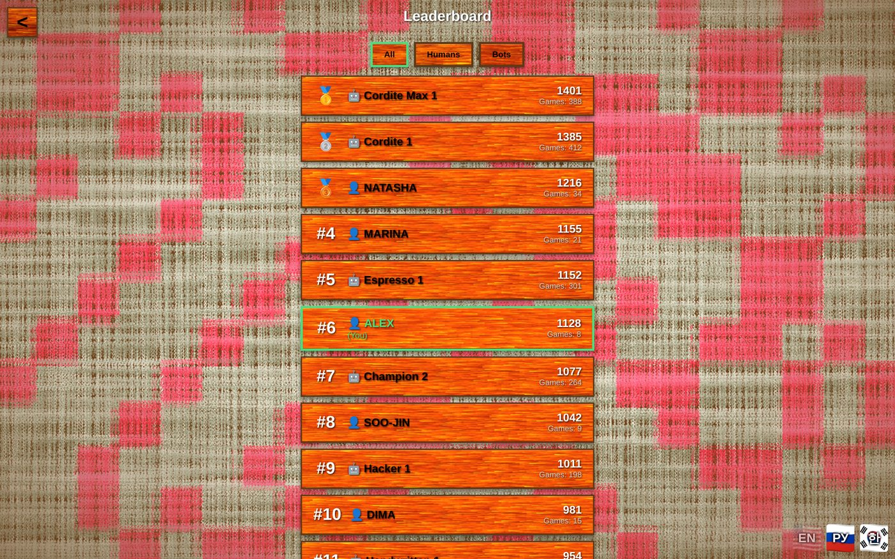
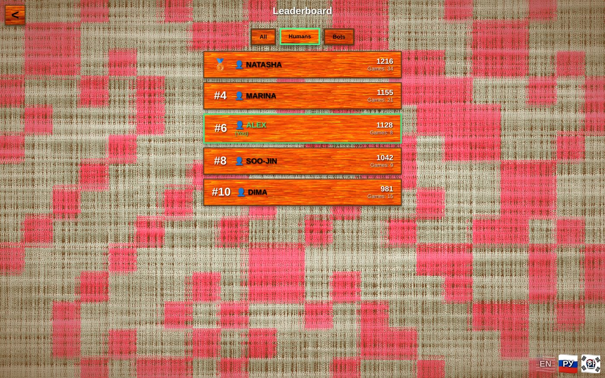
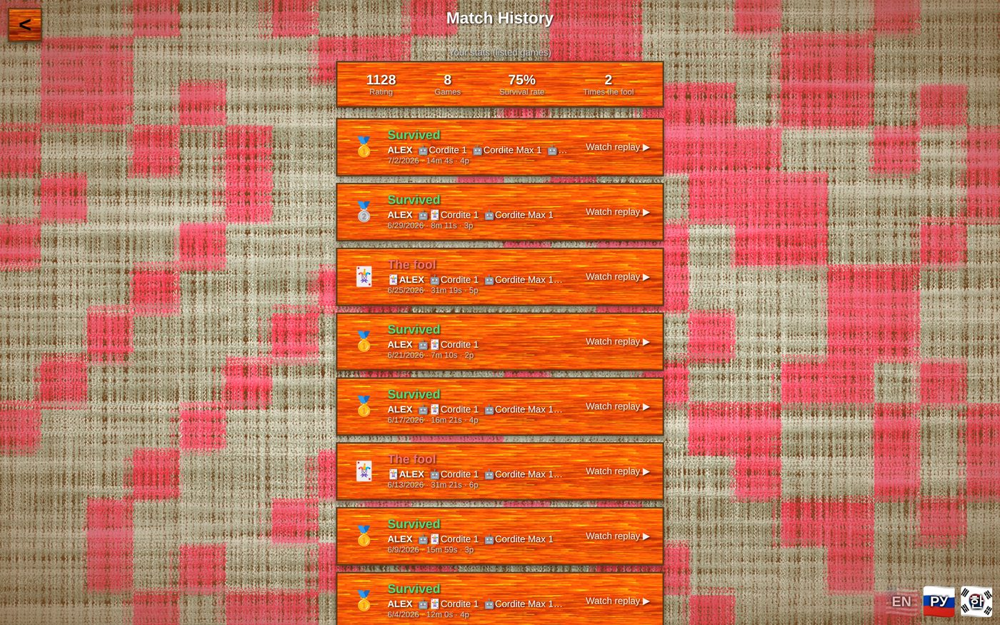
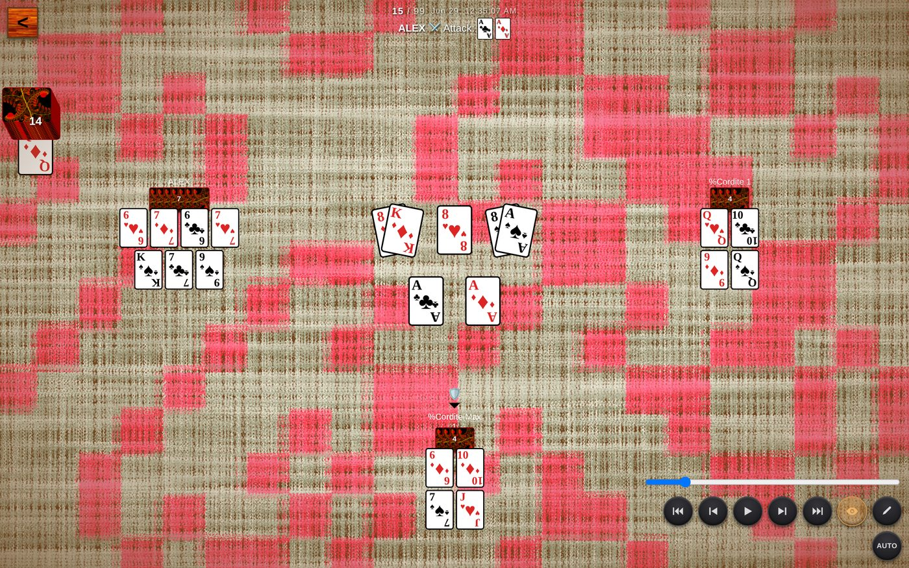

# Roadmap — project analysis & feature report

*Analysis date: July 2026. This is a feature-gap review of the whole repo —
client (`src/`), Supabase backend (`supabase/`), the C engine (`cnitro/`), the
offline/ML layer (`offlinefun/`), and the e2e suite — with a prioritized list
of what's worth building next. The two P0 items are implemented on this branch;
screenshots are in [`docs/screenshots/`](docs/screenshots/).*

---

## Where the project stands

The engineering core is unusually deep and healthy: one canonical ruleset kept
in lockstep across four engines (TS server, TS client reconciliation, pure C,
replay codec), a bot ladder topped by a Monte-Carlo player, a QR-sized replay
format, procedural rendering with zero shipped textures, and an e2e suite that
runs the *actual deployed* server modules against real Postgres.

What lags behind is the **product shell around the game**. Several systems are
built and paid for on the backend but never surfaced to players:

| System | Backend state | Player-visible state (before this branch) |
| --- | --- | --- |
| Elo ratings | Computed pairwise per game for humans *and* bots; stored, indexed, publicly readable | Shown once, on the WinScreen of the game that changed it. No standings anywhere. |
| Finished games | Every game compressed to a `game_snapshots` row that outlives the lobby, ACL'd to its participants | Reachable only from the WinScreen moment. Lose the URL → the game is gone forever. |
| Spectating | Realtime spectator channel, auto-spectate logic in `ServerContext` | No entry point in the UI. |
| Chat, replays, tutorial | Fully built | Fine — but the tutorial isn't linked from anywhere. |

That mismatch — expensive machinery with no doorway — is where the highest
value-per-effort work is, and it's what the two implemented items address.

---

## P0 — implemented on this branch ✅

### 1. Leaderboard (`/leaderboard`)

**Why first:** the game computes Elo for every human and bot after every game
and the table has always been world-readable with an index on `elo_rating` —
there was simply no page that ranked it. A ladder is the single strongest
retention feature a rated game can ship, and it cost one page + one column.

What was built:

- **`src/components/Leaderboard.tsx` + `/leaderboard` route** — one merged
  ladder for humans and bots (they play the same rated games, so their Elo is
  directly comparable), with All / Humans / Bots filter tabs, medal icons for
  the top three, games-played counts, and a highlight on your own row. Public,
  like `/about` — standings need no session.
- **`username` column on `user_elo_ratings`**
  (migration `20260702090000_leaderboard_usernames.sql`) — the rating rows were
  readable but unrenderable: the only identity on them was `user_id`, and
  usernames live in `auth.users` metadata, which clients can't read. The signup
  trigger now stamps the username onto the rating row (and follows metadata
  updates, so renames made outside the app can't leave a stale copy), and the
  migration backfills existing users.
- **Nav buttons on the dashboard**, localized in en/ru/ko like everything else.
- **e2e coverage** (`e2e/leaderboard.test.ts`): the real seed.sql trigger
  stamps the username; the exact standings query the page runs ranks rated
  players and hides never-played accounts.

### 2. Match history + replay gallery (`/history`)

**Why second:** the replay codec is the repo's flagship — but a replay was only
reachable in the one moment the WinScreen was open. `game_snapshots` already
stored every finished game with a GIN-indexed participant ACL; nothing ever
queried it beyond the just-finished game.

What was built:

- **`src/components/MatchHistory.tsx` + `/history` route** — lists your 50 most
  recent finished games straight from `game_snapshots` (RLS returns exactly
  your games; no extra filter needed). Each row is decoded **client-side with
  the same codec the replay screen uses** — seat names, who was the fool, your
  placement (medal / fool icon), player count, date, and real game duration
  from the timing blob. Every row links to the self-contained replay URL, so
  any past game can be re-watched or shared, forever.
- **Personal stats header** — current rating, games played, survival rate,
  times-the-fool — computed from the same decoded snapshots (durak has no
  winner, only a survivor set, so "survival rate" is the honest stat).
- **`game_snapshots` migration** (`20260702090001_game_snapshots_table.sql`) —
  the table existed only in `seed.sql`; live databases had no migration
  creating it. Idempotent, mirrors the seed exactly.

A deliberate property of both features: **no new server endpoints.** They ride
existing RLS-protected tables and the existing codec, so the attack surface and
the deploy story don't change.

### Screenshots

Captured from the real production build driven end-to-end (Playwright). The
game data is real: the history games were **played by the actual engine**
(`start_game`/`processBotAction`, the same modules the server deploys) and
**encoded with the actual replay codec** — only the Supabase HTTP transport was
served by a local stand-in so the app runs hermetically.

| | |
| --- | --- |
|  *The existing welcome screen — entry to the flow.* |  *Dashboard with the two new nav buttons: Leaderboard and Match History.* |
|  *`/leaderboard`: one Elo ladder for humans and bots, medals for the top three, your row highlighted.* |  *The Humans filter tab.* |
|  *`/history`: personal stats header, then each finished game decoded from its snapshot — placement, fool marker, seat names, date, real duration.* |  *Clicking a history row opens the full VHS-style replay (here mid-game with all hands revealed) — proving the derived share codes decode.* |

---

## P1 — next up (high value, moderate effort)

### 3. Public game browser / matchmaking
Games are effectively unlisted — you see only your own; joining requires a
code/QR. The `games` table is already world-readable with `status` + `name`
indexes, so a "join a public game" list on the dashboard (WAITING games with an
open seat) is mostly client work plus one `is_public` flag and a lobby toggle.
This is the biggest onboarding gap: a new player with no friends online has
nobody to play but bots, and no way to find humans.

### 4. Guest / anonymous play
Signup (username + password) is required before you can touch anything —
`/tutorial` is the only playable thing without an account, and nothing links to
it. Supabase supports anonymous sign-ins natively; a "Play as guest" button
(auto-named, upgradeable to a real account later) plus a Welcome-page link to
the tutorial would cut the biggest funnel drop-off. Guests slot into the
existing `auth.users` machinery, so Elo/history just work.

### 5. Spectator entry points
The realtime spectator channel and client logic exist (`ServerContext`
subscribes and reconciles as a spectator), but there is no UI doorway. A
"watch" button on in-progress games (in the public browser above) makes
the feature real; a spectator-count badge in-game closes the loop.

### 6. Account recovery
Username+password with no reset path: the synthetic-email auth trick means a
forgotten password permanently strands the account (and its rating). Either an
optional recovery email or one-time recovery codes issued at signup.

## P2 — worth doing, needs design

### 7. Procedural sound
The client ships zero texture files; audio should keep that contract — WebAudio
synthesized card slaps, deals, and a fool sting, seeded like the visual
textures, with a mute toggle. No assets, fits the PWA offline story.

### 8. Rules variants
The engine hardcodes what could be options: deck size is derived from player
count (36 for ≤4, 52 for 5+; no 24-card), `CARDS_PER_PLAYER = 6`, transfer
(perevodnoy) is always on, attack ceiling is only the defender's hand size.
A `variant` config on `games` threaded through `refill_deck` and the handlers
is straightforward — **but the replay wire format is version-frozen (v2–v5)
and encodes none of this**, so variants need a v6 header field. Do the codec
design first; everything else follows.

### 9. Turn notifications
PWA + service worker already exist (`offlinefun/`), so Web Push for "it's your
move" / "your lobby is full" in async games is mostly permission UX and a small
edge-function sender keyed off the existing broadcast path.

### 10. Replay URL namespace (`/r/…`)
`classifyPathSegment` distinguishes replays from game ids **by length** —
explicitly flagged as fragile in `codec.ts` before wide sharing. Moving share
links to `/r/<code>` (redirect-compatible with old links) makes replay URLs
future-proof. Small, do it alongside any share-feature push.

### 11. Achievements / titles
Everything needed is already decoded client-side on `/history` (placements,
durations, comebacks, trump-heavy wins…), and the snapshot archive means
achievements can be granted retroactively. Cheap delight once history exists.

## Engineering debt worth scheduling

- **`GameStateSource` unification** (`docs/REFACTOR_NOTES.md`) — one live /
  replay / tutorial interface behind a single parameterized `GameBoard`. Was
  explicitly deferred "after cordite"; cordite shipped. The tutorial and replay
  screens each re-derive board state today, and every new surface (spectate,
  history previews) pays that tax again.
- **RLS coverage in e2e** — the harness connects as superuser, so policies
  (the `game_snapshots` participant ACL above all) are never exercised by
  tests. A `SET ROLE authenticated` + `request.jwt.claims` fixture would close
  the one un-tested security layer.
- **Win/loss columns** — survival stats are currently recomputed from snapshots
  client-side (fine at ≤50 games); if profiles/achievements land, persist
  per-user aggregates at `finalizeEndedGame` time instead.

---

## Priority rationale in one paragraph

Ship the surfaces that expose already-paid-for value (P0: leaderboard,
history — both done here), then remove the reasons a new player bounces
(P1: public games, guest play, spectate, recovery), then invest in delight and
depth (P2: sound, variants, notifications, achievements) — while paying down
the one refactor (`GameStateSource`) that makes every future surface cheaper.
