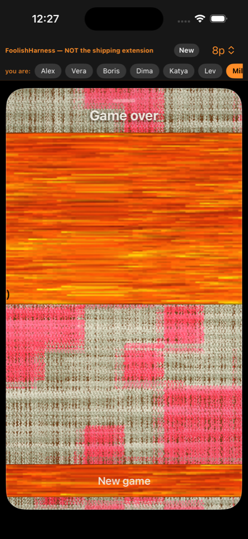
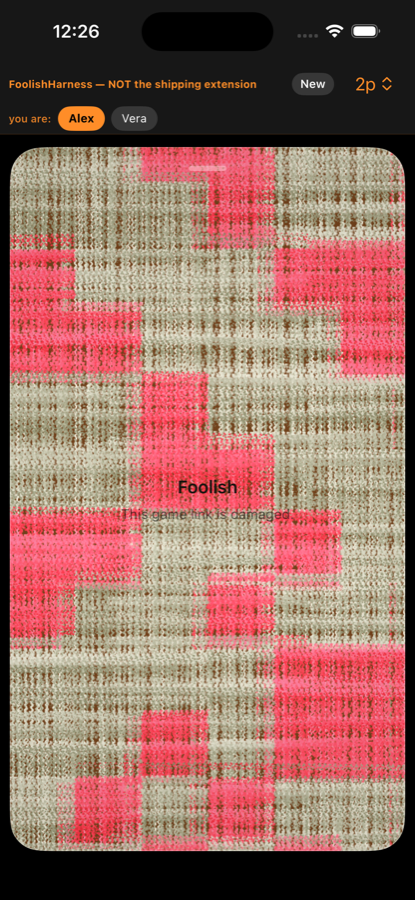
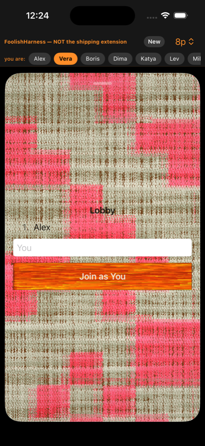
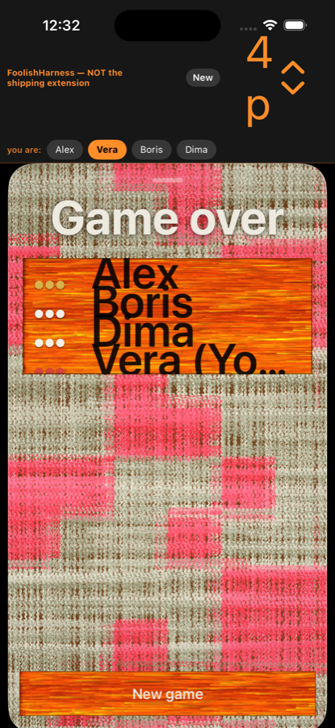
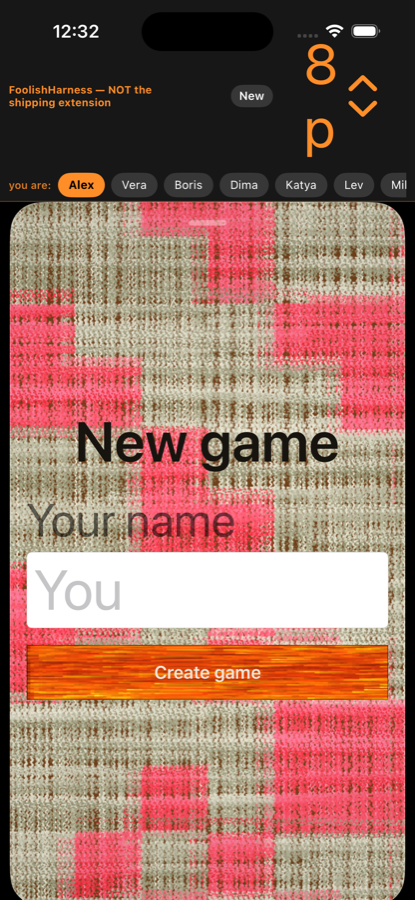
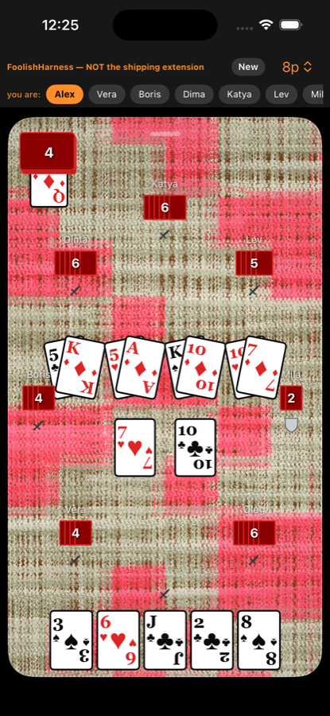
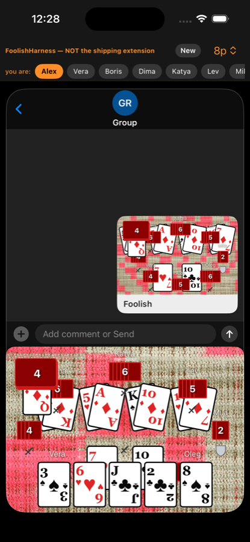

# Foolish for iMessage — App Store review findings

**Verdict: not approvable as submitted.** Four blockers, nine majors, eleven
minors, one item that needs a two-device check before it can be called anything.

This is the merged record of two independent adversarial passes over the same
build. Pass 1 swept the main flows and the submission metadata; pass 2 went to
the edges — a buried defender, an exhausted talon, a twenty-card hand, one
hostile join name at a time. They agree on more than they disagree, and where
they disagree it is recorded in [Where the two passes
disagreed](#where-the-two-passes-disagreed) rather than quietly averaged.

Neither pass read the design docs first. Everything below is a state that was
reached and looked at; code citations were added afterwards to explain what the
screenshot showed.

---

## How this was run

The shipping product is an `MSMessagesAppViewController`, and Apple's Messages
host cannot be handed 3-8 fake participants in a simulator. Both passes drove
`FoolishHarness`, which mounts the **same** `MessagesRootView` the extension
mounts and feeds it a fake transcript, via
`SIMCTL_CHILD_HARNESS_SCENARIO=<name>` (`ios/HarnessUI/HarnessScenario.swift`).
Each scenario calls the same model entry points the real chrome's buttons call —
no synthetic taps — and then stops, so the screenshot is of a settled state that
the app can genuinely be in.

Device: iPhone 16 (iOS 26.3) unless a shot is prefixed `r_se_` (iPhone SE, 4.7").
Screenshots: `docs/review-shots/` (pass 1, `s_*`) and `docs/review-shots-2/`
(pass 2, `r_*`).

**Read the screenshots with three caveats.**

1. The orange bar and the "you are:" pill row at the top of every shot are the
   **harness**, not the product. The product is everything below the black line.
2. Presentation-style transitions, real insert-vs-send semantics, and receiving
   a message while the extension is closed belong to Apple's host and are **not
   covered**. Nothing here is a verdict on those.
3. Findings that could be an artifact of the rig rather than the product are
   marked and say what would settle them. One row of pass 2's evidence turned
   out to be exactly that; see the disagreements section.

---

## Findings

| # | Severity | One line |
|---|---|---|
| **B1** | BLOCKER | A name over 12 **bytes** fails to seal and lands the user on "this game link is damaged" |
| **B2** | BLOCKER | The Game-over leaderboard walks off the screen as players are added |
| **B3** | BLOCKER | At accessibility text sizes the card faces lose their ranks — the game becomes unplayable |
| **B4** | BLOCKER | `UIRequiredDeviceCapabilities = armv7` will fail App Store Connect validation |
| **M1** | MAJOR | "This game link is damaged" is a dead end with no action on it |
| **M2** | MAJOR | Leaving the name blank makes your name the word "You" |
| **M3** | MAJOR | The Game-over list also collapses at large text, independently of B2 |
| **M4** | MAJOR | Dynamic Type has no policy: buttons never scale, cards scale without bound |
| **M5** | MAJOR | At 6-8 players the table is drawn through the seat names and badges |
| **M6** | MAJOR | A big hand compresses to slivers below the 44pt touch minimum |
| **M7** | MAJOR | Nothing on the board says it is your turn or what you may do |
| **M8** | MAJOR | The message bubble — the whole notification surface — carries no text |
| **M9** | MAJOR | Any lobby member can start the game on everyone else, with no confirmation |
| **M10** | MAJOR | Text contrast on the wool fails across every screen |
| **m1** | MINOR | Trump is communicated by a sliver of a card, and by nothing at all once the talon empties |
| **m2** | MINOR | VoiceOver labels are hard-coded English while all visible strings are localized |
| **m3** | MINOR | No onboarding, no rules, no help, anywhere |
| **m4** | MINOR | Unexplained iconography (crossed swords, grey shield) with no legend |
| **m5** | MINOR | Most of the table is dead space while the populated parts collide |
| **m6** | MINOR | Dark mode is ignored |
| **m7** | MINOR | Secondary buttons are effectively invisible |
| **m8** | MINOR | Three screens ask for your name three different ways |
| **m9** | MINOR | Deck and hand counts render as red error badges |
| **m10** | MINOR | No way to choose the game size; capacity is never stated |
| **m11** | MINOR | The background is hot pink tartan, not wool |
| **Q1** | QUESTION | ru/ko strings ship but no localization is declared to the store |
| **Q2** | QUESTION | `ITSAppUsesNonExemptEncryption = false` with SHA-256 on the payload path |

---

## Blockers

### B1. A name over 12 bytes breaks the game, silently, and blames the link

This one stops the submission on its own.

The setup screen takes a free-form name with **no length cap, no counter and no
inline validation** — `NewGameSetup`
(`ios/FoolishKit/Messages/MessagesRootView.swift:606-639`) is a bare `TextField`.
A 60-character name is accepted and "Create game" lights up
(`r_setup_longname.png`, `s_longname.png`; the field just ellipsises, so the UI
actively signals that it is fine). Sealing then fails, and `createWaiting`
(`:322-339`) turns *any* failure into `damaged = true`. The user types their own
name, taps Create game, and is told **the link** is damaged.

Pass 2 narrowed the boundary by seating one hostile name at a time. Pass 1
re-ran the rows that mattered:

| Name | UTF-8 bytes | Result | Shot |
|---|---|---|---|
| `Vera` | 4 | lobby renders | `r_name_control.png` |
| `Вера` | 8 | lobby renders | `r_name_cyr.png` |
| `Konstantinos` | 12 | lobby renders | `r_name_13.png` |
| `Konstantinoss` | 13 | **fails** | `r_name_13ascii.png` |
| `Владимир` | 16 | **fails** | `r_name_vladimir.png` |
| `🃏🂡🂢🂣🂤` | 20 | **fails** | `r_name_emoji.png` |
| `<script>alert(1)</script>` | 25 | **fails** | `r_name_script.png` |
| `Bartholomew Aloysius Featherstonehaugh` | 38 | **fails** | `r_name_long.png` |

The cap is `MSG_MAX_NAME 12` (`c/src/msg_wire.h:111`), rejected as `MSG_ENAME`
(`:138`, enforced at `c/src/msg_wire.c:93`). Twelve **bytes**, not characters.
So:

- **Владимир — eight letters — does not fit.** Nor Екатерина, Александр,
  Константин. This app ships a Russian localization for a Russian card game and
  cannot accept a majority of common Russian given names. Korean is three bytes
  per syllable, so a four-syllable Korean name breaks too.
- The failure is silent at the seal layer. `r_longnames.png` /
  `s_lobbylong` show a lobby seeded with four hostile names simply **not
  appearing** — the app fell through to the New game screen with no message.

Fixing this needs all three parts, and the third is the one that turns a
blocker into a papercut:

1. a byte-aware cap enforced in the text field,
2. truncation or rejection the user can see,
3. an error path that does not claim the link is damaged when nothing is wrong
   with the link (see M1).

Whether 12 bytes is the right wire budget at all is a format decision and the
owner's call. Shipping at 12 means shipping a game that cannot spell its
players' names.

### B2. The Game-over leaderboard grows off the side of the screen

The one screen the whole game exists to produce, and it degrades monotonically
with player count. Between them the two passes covered every supported count:

| Players | Result | Shot |
|---|---|---|
| 2 | correct | `s_end2.png` |
| 3 | correct | `r_end3.png` |
| 4 | correct | `s_end4.png` |
| 5 | rank column sliced at the left edge; `Fool` reads as `ool` | `r_end5.png` |
| 6 | rank column entirely gone; plank breaks its padding and goes edge-to-edge | `s_end6.png` |
| 7 | **name column off-screen**; blank slab with letter fragments bleeding off the left | `r_end7.png` |
| 8 | **plank completely blank**; the only surviving glyph is a stray `)` | `s_end8.png` |



The eight-player game — the headline feature, the reason the seat-ring and
badge-collision work exists — ends by showing everyone an empty orange board.

Not device-specific: the same failure on iPhone SE (`r_se_end5.png`), where the
"New game" button is additionally clipped by the bottom edge.

**Root cause** (`ios/FoolishKit/Boards/MessageTableView.swift:1205-1238`,
`FGameOverList`): the ranking is `ZStack { WoodFill(); rows }` constrained with
`.frame(height: plankHeight)` **only**. `WoodFill` is an aspect-**fill** image,
so the width it proposes scales with the height it is handed. More players →
taller plank → wider plank → overflows the surface, gets centred, and clips both
ends. The fixed-width rank column (`.frame(width: 56)`, `:1223`) is the first
thing off the left edge; by seven rows the names follow it. The
`.clipShape(Rectangle())` then hides the evidence rather than the cause.

Fix: `.frame(maxWidth: .infinity, height: plankHeight)`. Test: assert the rank
text is visible at every count 2...8, so this cannot regress into a nudged
constant.

### B3. At accessibility text sizes the cards lose their ranks

At Accessibility XXXL (`r_a11y_take.png`) every playing card loses its rank
entirely and the suit pip scales **past the card's own bounds** — detached
hearts, spades and diamonds float over the tabletop above and below each card.
There is no way to tell a 7 from a King, in hand or on the table. The "Pickup"
button label is clipped to "ickup" with a stray club pip sitting on it.

A card game whose cards cannot be read at a supported text size is not playable
at that setting.

Fix: card faces need to opt out (`.dynamicTypeSize(...)` clamp) or use
geometry-relative type, and the pip needs clipping to the card.

### B4. `UIRequiredDeviceCapabilities = armv7`

`ios/FoolishMessagesApp/Info.plist:40-43`:

```xml
<key>UIRequiredDeviceCapabilities</key>
<array><string>armv7</string></array>
```

`armv7` is the 32-bit capability; the app is arm64-only. App Store Connect
rejects this combination at upload — it reads as "requires a device this binary
cannot run on". Not a judgement call and not something a UI pass can catch: it
is a metadata contradiction the validator sees before a human does.

It survived precisely because it is harmless at runtime — that container is
`LSApplicationLaunchProhibited`, a codeless shell that never launches, so the
wrong capability never bites until upload.

Fix: `arm64`, or delete the key (it buys nothing here).

---

## Major

### M1. "This game link is damaged" is a dead end

`s_damaged.png` (garbage payload), `r_damaged_trunc.png` (truncated link),
`r_foreign.png` (a `foolish.cards` URL that is not a game). All three land on a
title, one line of body copy at 55% black over a busy pink weave, and **nothing
else** — no "Start a new game", no retry, no dismiss. The only exit is closing
the extension, which nothing on screen suggests.



Every reachable error state needs an action, and B1 routes an ordinary user
action straight into this one.

### M2. Leaving the name blank makes your name the word "You"

`FStrings.t("ios.you")` is the placeholder **and** the empty-field fallback
(`MessagesRootView.swift:633-635`, `:367-368`). The join button therefore renders
literally **"Join as You"** (`s_lobbyrecv.png`, `r_spectator.png`) — the
placeholder promoted into the call to action. The roster then shows a player
called "You" one line above another player marked "(You)": two meanings, one
word, same screen. The first harness run of pass 1 produced a lobby reading
`1. You (You)`.



Fix: reject blank, or fall back to the Messages participant name — something
that reads as a default rather than as an unfilled form field.

### M3. The Game-over list also collapses at large text

Same screen as B2, different axis, and they fail **independently**. At AX-XXXL
with 5 players (`r_a11y_end5.png`) and 4 (`s_a11y_end.png`): rows are pinned to
a fixed row height so the names overlap line-on-line, the last row is sliced by
the plank's hard clip, and the rank column degenerates to a pair of truncation
dots (`•••`).



`rowH: CGFloat = 34` (`MessageTableView.swift:1188`) and `.frame(width: 56)`
(`:1223`) are hardcoded points with no `@ScaledMetric`.

### M4. Dynamic Type has no policy — and fails in both directions

The two halves of this look like opposite bugs and are the same absence.

**Fixed where it should scale.** `ios/FoolishKit/DesignSystem/Tokens.swift:50-55`:

```swift
public static func body(_ size: CGFloat = 15) -> Font { .system(size: size, ...) }
public static func title(_ size: CGFloat = 22) -> Font { .system(size: size, ...) }
```

`.system(size:)` is frozen at whatever was typed. So at AX-XXXL, "New game",
"Your name" and the text field all scale correctly — they use
`.headline`/`.footnote` — while **"Create game" does not** (`s_a11y_setup.png`).
Same in the lobby: everything grows, **"Join as You" stays small**
(`s_a11y_lobby.png`). The one control the user must hit is the one that never
scales.



**Unbounded where it should clamp.** The card faces (B3) scale their pips right
out of the card.

One policy decision — which surfaces scale, which clamp, and to what — fixes
B3, M3 and M4 together. Doing it screen by screen will not.

### M5. At 6-8 players the table is drawn through the seat names and badges

`s_board8.png`, `r_board8_busy.png`:



- The leftmost battle's attack card is clipped by the left screen edge and
  overlaps both Boris's name and his count badge.
- The rightmost battle overlaps "Mila" and her badge.
- The grey shield marker sits half under the battle row.
- The uncovered attacks on the second row are centred on a different axis from
  the covered pairs above them, so there is no reading order — you cannot tell
  at a glance which attacks still need covering, which is the *only* question a
  defender has.

On the SE (`r_se_board8.png`) it is worse: Boris's badge is behind a card and the
player's own hand is clipped by the bottom edge.

The seat ring was widened to fix badge-vs-badge collision. It did not address
card-vs-badge, which is the collision that hides information. The layout has no
reserved gutters; it stacks and hopes.

The same pile-up is baked into the **compact drawer** (`s_compact.png`,
`r_compact.png`), which is where the user spends most of their time — the
extension collapses there after every staged move. In one 261pt strip the deck
badge sits on the trump card *and* on a seat badge *and* on a name; battle cards
are drawn over "Boris" and "Mila"; "Vera" is drawn on top of a battle card; the
player's own hand buries the second battle row.



The drawer is rendering the full expanded layout squeezed into a third of the
height, with the bottom cropped off — two of four seats and every action control
are simply outside the crop. Overlap is the guaranteed outcome, not a tuning
miss. Compact needs its own layout answering "whose turn, how many cards, what's
on the table", not a scale model of the ring.

### M6. A big hand compresses instead of fanning

`r_bighand.png` — 11 cards. Each is squeezed to a ~44pt sliver with a distorted
aspect ratio; the mirrored bottom-right index is gone and one pip survives.
Durak routinely leaves a defender holding 15-20 cards after two pickups, which
puts card width **below Apple's 44pt minimum hit target** — and these are drag
sources, not taps. Fan or overlap them.

### M7. Nothing on the board says it is your turn or what you may do

`r_endgame.png`: it is my move, the table is empty, and the screen offers no
button, no prompt, no highlight — just my hand and a lot of tabletop. The only
way to attack is to drag a card, which is stated nowhere. `r_take.png` offers a
single "Pickup" button while covering — the other legal option — remains a
hidden drag gesture.

### M8. The message bubble does not say what happened

`r_compact.png`, top half: what lands in the thread is an unlabeled pink
rectangle captioned "Foolish", inside which the trump card is drawn on top of a
seat's count badge. In a group thread this bubble is the **entire notification
surface** for a turn-based game and it carries no text — not whose turn it is,
not what the last player did. For any turn-based iMessage game the bubble is the
product.

### M9. Any lobby member can start the game on everyone else

`r_lobby_partial.png` — 3 of 8 joined, and "Start game" is offered to Boris, who
joined last. One tap and the other five people in the chat are locked out, with
no warning and no confirmation. The screen never states capacity ("3 of 8") and
offers no invite affordance in this state — which, per
`LobbyControls.offered`, is the state a group game sits in most of the time.

### M10. Text contrast on the wool fails, everywhere

Systemic, not per-screen: body copy is drawn directly onto a high-frequency
two-tone weave with no scrim, no plate, and mostly no shadow. Unreadable at 1:1
in our own screenshots:

- "Waiting for the others" (`s_lobbymine.png`)
- "This game link is damaged" (`s_damaged.png`, `r_damaged_trunc.png`)
- "Your name", 55% black (`s_setup8.png`, `r_chatswitch.png`)
- seat names "Boris" / "Mila", white 11pt (`s_board8.png`)
- `#1` pale gold and `Fool` dark red on orange wood (`s_end4.png`, `r_end3.png`)
  — the two rows a player cares about are the two least legible on the screen

The background is a procedural texture with a hot-pink thread mixed in
(`WoolTexture.swift:139-155`), so its luminance changes every few pixels. **No
fixed-opacity foreground can survive it** — this needs a plate or a scrim, not a
darker grey.

The fix already exists in the codebase and is applied to exactly one string:
"Game over" carries `.shadow(color: .black.opacity(0.6), radius: 3)` and is
perfectly readable.

There is also no handling of Increase Contrast or Reduce Transparency anywhere
(zero uses of `accessibilityReduceTransparency` or
`accessibilityDifferentiateWithoutColor` in shipping code).

---

## Minor

- **m1. Trump is a sliver of a card.** On every board the trump peeks out from
  *under* the deck stack, roughly a third of a hand card and half occluded — at
  8 players the deck badge sits directly on it (`s_board2.png`,
  `r_board8_busy.png`). When the talon empties it becomes a bare unlabeled ♠
  glyph in the top-left corner (`r_endgame.png`). Trump suit is the single most
  consequential fact in Durak and has no first-class indicator.
- **m2. VoiceOver labels are hard-coded English.** `FDeckWell`, `FBattleGrid`,
  `FSeatBadge`, `FCard` and `MessageTableView` pass English literals to
  `.accessibilityLabel` ("You attack first", "N cards discarded") while all 116
  visible strings go through the localization table. A Russian or Korean
  VoiceOver user gets an English board. The labels are otherwise well chosen —
  this is a wiring problem, not a missing feature.
- **m3. No onboarding, no rules, no help.** Tapping "Create game" with no idea
  what Foolish is gets you a board that teaches none of the rules. Durak is not
  common knowledge outside a handful of countries.
- **m4. Unexplained iconography.** Crossed-sword glyphs next to every seat and a
  grey shield next to one, with no legend and, at the size they are drawn on
  this background, no legibility. (They *do* carry `accessibilityLabel`s —
  `MessageTableView.swift:1145`, `:1167` — so VoiceOver users are better served
  here than sighted ones.)
- **m5. Most of the table is dead space** while the populated parts collide
  (`s_board2.png`, `r_endgame.png`, `r_bighand.png`). The lobby is ~70% bare
  weave at one player, and within its content "Lobby" is centred, "1. Alex
  (You)" is left-aligned at x≈100, and "Waiting for the others" is centred
  again — three anchors in three consecutive lines (`s_lobbymine.png`). It
  reads as tuned at capacity and never checked at one.
- **m6. Dark mode is ignored.** `r_dark_take.png` is pixel-identical to the
  light shot. A full-bleed hot-pink panel inside a dark Messages thread at night
  is jarring. (Pass 1 initially read this as a defensible choice for a game
  table; see the disagreements section.)
- **m7. Secondary buttons are effectively invisible** — white text on a clear
  fill over the weave (`s_seatpick.png`, `r_seatpick8.png`). That screen is
  `#if DEBUG`-gated and Release correctly shows a spectator board instead, but
  the button style is shared with shipping surfaces.
- **m8. Three screens ask for your name three different ways.** Setup: "New
  game" / "Your name" / **"Create game"**. Lobby: no label / **"Join as You"**.
  Name gate: "What should we call you?" / **"Continue"** (`s_namegate.png`).
  Same widget, same placeholder, three titles, three button conventions.
- **m9. Deck and hand counts read as error badges** — saturated red rounded
  rects with white numerals, visually identical to an iOS unread badge, for
  neutral information (`s_board2.png`, `s_board8.png`).
- **m10. No way to choose the game size.** Capacity is implicit (2 in a DM, 8 in
  a group) and never surfaced. Five friends in a chat of eight cannot say so.
- **m11. The background is hot pink tartan, not wool.** Two pieces of
  arithmetic, neither of them taste. *Colour:* `WoolTexture.swift:139-142` takes
  a beige base and applies `R+100, G−100, B−50`; from `(209, 208, 183)` that is
  `(309→255, 108, 133)` = `#FF6C85`, fluorescent pink. It is not a red that
  drifted, it is a beige with a magenta delta bolted on and clamped. *Scale:*
  `WoolBackground.screenFitScale` (`Materials.swift:29-33`) covers a 1920×1080
  landscape texture onto a portrait screen — `max(393/1920, 852/1080)` = 0.79 —
  so the surface shows about a quarter of the texture's width and an 80px weave
  block lands at ~63pt. It reads as a picnic blanket photographed from four
  inches away. This now matches the web generator exactly, which is a good
  reason for the *code* to look like this and not for the *screen* to. Owner has
  flagged the pink as their call; recorded because a reviewer's first impression
  is "why is my card table neon pink".

---

## Questions

**Q1. Russian and Korean ship, but no localization is declared.** `FStrings`
carries a full en/ru/ko table (`FStrings.swift:48+`, all 33 iMessage keys present
in each) and switches on `Locale.preferredLanguages`. But there is no `.lproj`,
no String Catalog, and no `CFBundleLocalizations` in either Info.plist — so the
store listing advertises English only while the app silently presents Russian.
Separately, `FStrings.override` is stored in `UserDefaults.standard`
(`FStrings.swift:26-27`), which inside an app extension is the **extension's own**
container, not the App Group — a language chosen in the host app never reaches
the iMessage extension. (The game cache correctly uses the App Group suite,
`MessageGameStore.swift:105`, so this looks like an oversight.) Is ru/ko intended
to ship in 1.0? If yes, both need fixing; if no, it should not be reachable.

**Q2. `ITSAppUsesNonExemptEncryption = false` with SHA-256 on the payload path.**
The chain uses SHA-256 for the parent digest (`c/src/sha256.c`; swift-crypto is
linked). Hashing is not encryption and `false` is very probably correct — but it
should be a deliberate answer rather than an inherited template value, because
it changes if anything on the FMSG path ever starts encrypting rather than
digesting.

---

## Needs verification on real devices (not called a defect)

**Opening an older lobby bubble showed a stale roster and offered a seat already
held.** `r_oldbubble.png`: a thread with two lobby bubbles (Alex+Vera, then
Alex+Vera+Boris+Dima). Tapping the *older* one as Alex showed the 2-person roster
and a lit "Join as Alex" — a join that would seat a second Alex.

Flagged as unconfirmed on purpose. The rig produced two lobby chains carrying the
same game id and identical parent hashes, which gives the chain ranking nothing
to order them by, and the receiving "device" had an empty seat cache where a real
creator's device would have one. Either could be the whole explanation. Worth a
two-device check because the failure mode — duplicate seat, stale roster — is
expensive if real.

---

## Where the two passes disagreed

Recorded rather than averaged, because the disagreements are informative.

**1. Whitespace-only names — pass 2's table row is wrong.** Pass 2 listed
`····` (four spaces, 4 bytes) as *failing to seal*. Re-run under pass 1's rig,
**it seals fine**: `v_ws` renders a lobby whose second row is `2.` followed by a
blank name and `(You)`. The wire agrees — `name_is_clean`
(`c/src/msg_wire.c:52-60`) rejects only control bytes (`< 0x20`, `0x7f`), and
space is `0x20`. The likely explanation is the shell dropping a quoted
all-spaces `HARNESS_NAME`. Every other row of that table reproduced exactly,
including the 12-byte / 13-byte boundary.

That correction exposes a smaller real finding neither pass named: **a
whitespace-only name seals and renders an anonymous, nameless player.** A user
cannot reach it through the UI (both `NewGameSetup` and `joinLobby` trim and
substitute "You"), but the wire accepts it, so a modified client can seat an
invisible player. Low severity; worth a byte-level check alongside B1's cap.

**2. Dark mode.** Pass 1 recorded light-vs-dark being pixel-identical
(`s_light_setup.png` vs `s_setup8.png`) as *defensible* — a game table is a
physical surface and need not invert. Pass 2 called it a defect (m6). Both are
right about different things: not inverting is fine, but a full-bleed
fluorescent-pink panel at night is not, and that is m11's problem wearing m6's
clothes. Fixing the colour largely dissolves this one.

**3. The Game-over threshold.** Pass 1 tested even counts (2/4/6/8), pass 2 odd
(3/5/7), and each described the failure at the counts it saw. Neither was wrong;
the merged table in B2 shows the actual gradient, and pass 2's root cause
(aspect-fill width tracking height) is the correct and more specific one — pass
1 had only got as far as "greedy `WoodFill` in a `ZStack`".

**4. Localization.** Pass 2 filed "visible strings are fully localized" under
*what worked*; pass 1 filed "no localization declared to the store" as a
question. Both hold — they are different layers, and Q1 now says so.

---

## What held up

Both passes actively tried to break these and could not. This section carries
the same weight as the list above: do not "fix" anything in it.

- **Conversation scoping holds.** Staging a game in one thread and switching to
  another lands cleanly on New game; no board leaks across threads
  (`r_chatswitch.png`).
- **Corrupt input is handled, not crashed.** A truncated payload, a right-prefix
  wrong-length payload, and a non-game `foolish.cards` URL all produce the
  damaged screen rather than a crash or a garbage board (`s_damaged.png`,
  `r_damaged_trunc.png`, `r_foreign.png`). The complaint is the dead end (M1),
  not the detection.
- **Release refuses to offer a seat picker** on an ambiguous identity and shows
  a public spectator board instead, so a receiver cannot claim someone else's
  hand and read it. Correct security posture, and deliberate in the code.
- **Dismissing the drawer leaves a normal, usable chat** with the compose bar
  and "+" intact (`s_dismissed.png`, `r_dismissed.png`) — no trapped state. An
  earlier build apparently stranded the user with neither.
- **Privacy manifests are right.** `FoolishKit/PrivacyInfo.xcprivacy` declares
  `NSPrivacyAccessedAPICategoryUserDefaults` with both `CA92.1` (standard
  defaults, language override) and `1C8F.1` (App Group suite, game cache) —
  exactly the pair the code uses. No tracking, no collected data types. This is
  the most common cause of an automated rejection today and it is handled.
- **The iMessage icon set is complete** — 12 declared images in
  `iMessage App Icon.stickersiconset`, all present. A missing one is an upload
  failure.
- **`LSApplicationLaunchProhibited = true`** on the container is correct for a
  codeless iMessage app.
- **Reduce Motion is honoured** — `@Environment(\.accessibilityReduceMotion)` in
  `MessageTableView`, `TableView`, `FSeatBadge`.
- **The board carries VoiceOver labels** on cards, battles, badges, deck and
  discard. Not complete, but far from the zero a hand-drawn board suggests.
  (Their language is m2.)
- **Visible strings are fully localized** across en/ru/ko, all 33 iMessage keys
  present in each — which is exactly why B1 and m2 stand out.
- **The lobby scales with Dynamic Type** (`r_a11y_lobby.png`). It is the one
  screen that does.
- **Long names do not break the setup layout** — the field ellipsises cleanly
  (`s_longname.png`, `r_setup_longname.png`). The damage is downstream, at the
  wire.
- **2-, 3- and 4-player Game over are correct and readable**, which is what makes
  B2 a scaling bug rather than a broken screen.

---

## Closing read

The game logic held up under everything both passes threw at it — malformed
links, stale bubbles, cross-thread switching, 8-way tables, an exhausted talon,
a 20-card hand. Nothing crashed and nothing produced a wrong board.

Every blocker is in the layer above it: **input validation** (B1), **layout
constraints** (B2, B3, M3, M5, M6), **submission metadata** (B4), and **telling
the player what is going on** (M1, M7, M8). That is a good place for the
problems to be, and it means the fix list is bounded.

---

## Reproducing any of this

```
xcodebuild -project ios/Foolish.xcodeproj -scheme FoolishHarness \
  -sdk iphonesimulator -destination 'platform=iOS Simulator,id=<SIM>' \
  -derivedDataPath /tmp/foolish-harness-dd build
xcrun simctl install <SIM> /tmp/foolish-harness-dd/Build/Products/Debug-iphonesimulator/FoolishHarness.app
SIMCTL_CHILD_HARNESS_SCENARIO=lobby-received SIMCTL_CHILD_HARNESS_PLAYERS=8 \
  xcrun simctl launch <SIM> cards.foolish.harness
xcrun simctl io <SIM> screenshot shot.png
```

Scenarios (`ios/HarnessUI/HarnessScenario.swift`): `setup`, `setup-longname`,
`lobby-mine`, `lobby-received`, `lobby-half`, `lobby-partial`, `lobby-full`,
`lobby-longnames`, `lobby-name` (+`HARNESS_NAME`), `board`, `board-compact`,
`take`, `endgame`, `bighand`, `spectator`, `oldbubble`, `chatswitch`,
`namegate`, `seatpick`, `seatpick-8`, `damaged`, `damaged-empty`,
`damaged-truncated`, `foreign-scheme`, `dismissed`, `chatlist`.

Combine with `HARNESS_PLAYERS`, and with `HARNESS_SEED`, `HARNESS_SEED_PLAY`,
`HARNESS_ENDSCREEN`, `HARNESS_COMPACT`.

Accessibility and appearance passes:

```
xcrun simctl ui <SIM> content_size accessibility-extra-extra-extra-large
xcrun simctl ui <SIM> appearance light
```

**Housekeeping:** `docs/review-shots-2/` is 139MB of full-resolution PNGs
(`docs/review-shots/` is 13MB downscaled). Worth downscaling before this branch
merges.
