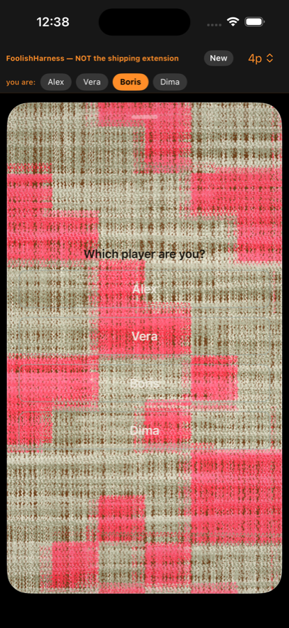
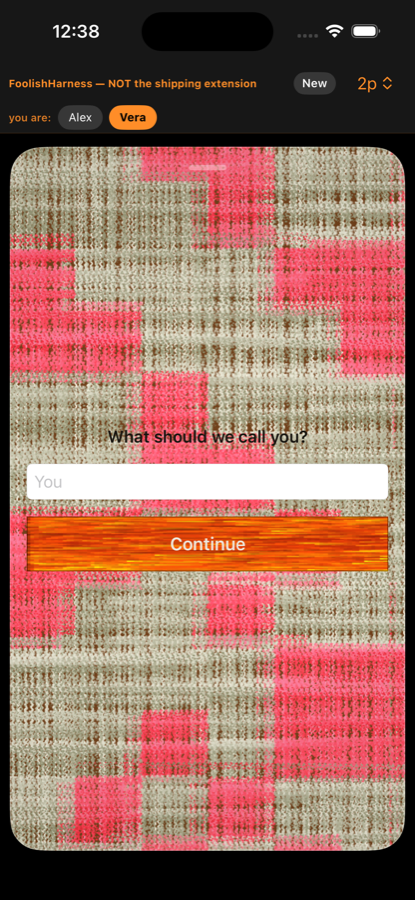

# Foolish for iMessage — adversarial review pass

Reviewer stance: an App Store reviewer with twenty minutes, a checklist, and no
patience. Nothing below is taken on trust from the code; every UI claim is a
state I reached and screenshotted, and every code citation was read afterwards
to explain what I saw.

**Rig.** iPhone 16 / iOS 26.3 simulator, `FoolishHarness` (Debug), driven
entirely by code — `HARNESS_SCENARIO=<name>` (new, `ios/HarnessUI/HarnessScenario.swift`)
puts the harness into one named state through the same model API the chrome's
buttons drive, then stops, so the screenshot is settled and the state is one the
app can genuinely be in. Screenshots in `docs/review-shots/`.

**Caveat I am holding myself to.** The harness is not Messages. Where a finding
could be an artifact of the rig rather than the product, it is marked
**(RIG?)** and says what would settle it.

Severity: **BLOCKER** — I reject. **MAJOR** — I flag and expect a fix.
**MINOR** — polish. **QUESTION** — I need an answer.

---

## Summary

Eighteen findings. Three of them stop the submission on their own:

| # | Severity | One line |
|---|---|---|
| 1 | BLOCKER | `UIRequiredDeviceCapabilities = armv7` will fail App Store Connect validation |
| 2 | BLOCKER | The Game-over screen stops showing the result at 6+ players |
| 3 | BLOCKER | "This game link is damaged" is a dead end with no way out |
| 4 | MAJOR | Dynamic Type: the whole design system uses fixed point sizes |
| 5 | MAJOR | A legal 13-byte name (any 7-letter Cyrillic name) bricks game creation |
| 6 | MAJOR | The compact drawer at 6-8 players is an unreadable pile-up |
| 7 | MAJOR | The 8-player board draws cards over player names and badges |
| 8 | MAJOR | Text contrast on the wool fails legibility across every screen |
| 9 | MAJOR | "You" is a placeholder that becomes your actual name |
| 10 | MINOR | The background is hot pink tartan, not wool |
| 11 | MINOR | No onboarding, no rules, no help, anywhere |
| 12 | MINOR | Unlabelled glyphs (`×`, the grey shield) with no legend |
| 13 | MINOR | Trump card is the least visible thing on the board |
| 14 | MINOR | Three different screens ask for your name three different ways |
| 15 | MINOR | Deck/hand counts are red badges that read as errors |
| 16 | MINOR | The lobby is 70% empty space and the roster alignment is inconsistent |
| 17 | QUESTION | ru/ko strings ship but no localization is declared |
| 18 | QUESTION | `ITSAppUsesNonExemptEncryption = false` with SHA-256 in the payload path |

Things I went looking for and found **correct** are in "What held up" at the end.
That section matters as much as the list above.

---

## BLOCKERS

### 1. `UIRequiredDeviceCapabilities = armv7` — BLOCKER

`ios/FoolishMessagesApp/Info.plist:40-42` declares:

```xml
<key>UIRequiredDeviceCapabilities</key>
<array><string>armv7</string></array>
```

`armv7` is the 32-bit capability. The app is built arm64-only. App Store Connect
rejects this combination at upload — it reads as "requires a device this binary
cannot run on". This is not a judgement call and not something I have to
reproduce in the UI; it is a metadata contradiction that the validator catches
before a human ever sees the app.

Fix: `arm64`, or delete the key entirely (it buys nothing here).

Note this is on the **container** app, which is `LSApplicationLaunchProhibited`
— a codeless shell. That is exactly why nobody noticed: the shell is never
launched, so the wrong capability never bites at runtime. It bites at upload.

### 2. The Game-over screen stops showing the result at 6+ players — BLOCKER

The single screen the whole game exists to produce, and it breaks as a function
of player count.

- 2 players (`s_end2.png`): correct. `#1 Alex` / `Fool Vera (You)`.
- 4 players (`s_end4.png`): correct. `#1 #2 #3 Fool`.
- **6 players (`s_end6.png`): the entire rank column is gone.** Six names, no
  `#1`, no `Fool`. You cannot tell who won or who lost. The plank has also
  broken out of its `.padding(.horizontal, 4)` and gone edge-to-edge.
- **8 players (`s_end8.png`): the plank is completely blank.** The only glyph
  that survives is a stray `)` at the far-left edge — the tail of `(You)`. The
  whole list has been pushed off the left side of the screen.


The eight-player game — the headline feature, the reason the seat ring and the
badge collision work exists at all — ends by showing the players an empty orange
board. I did not have to hunt for this; it is the last screen of the first
eight-player game I finished.

Code: `ios/FoolishKit/Boards/MessageTableView.swift:1194-1244`, `FGameOverList`.
The rank `Text` has `.frame(width: 56, alignment: .leading)` inside an `HStack`
inside a `ZStack` whose other layer is `WoodFill`, which is greedy
(`.frame(maxWidth: .infinity)` internally). Past some row count the ZStack
resolves wider than the surface, the rows centre inside it, and the fixed-width
rank column is the first thing to fall off the left edge; by 8 rows the names
follow it. The `.clipShape(Rectangle())` then hides the evidence rather than the
cause.

I want a test that asserts the rank text is visible at every count 2...8, not a
nudged constant.

### 3. "This game link is damaged" is a dead end — BLOCKER

`s_damaged.png`. Open a bubble whose payload does not decode and you get a
title, a sentence, and **nothing else**. No "Start a new game". No "Back". No
retry. The extension is bricked until the user thinks to swipe the drawer away
and find the `+` again — and nothing on the screen suggests that.


Every reachable error state needs an action. This one is reachable by more than
corruption: see finding 5, where a perfectly ordinary name lands the *creator*
here on their very first tap.

The text is also rendered black-on-weave with no scrim, which at this size is
already close to unreadable (finding 8).

---

## MAJOR

### 4. Dynamic Type — the design system opts out of it entirely

`ios/FoolishKit/DesignSystem/Tokens.swift:50-55`:

```swift
public static func body(_ size: CGFloat = 15) -> Font { .system(size: size, ...) }
public static func title(_ size: CGFloat = 22) -> Font { .system(size: size, ...) }
```

`.system(size:)` is a fixed point size. It does not scale. Every control built
on `FType` is frozen at whatever the designer typed, forever, at every
accessibility setting.

You can see it directly. At AX-XXXL:

- `s_a11y_setup.png` — "New game", "Your name" and the text field all scale
  correctly (they use `.headline`/`.footnote`). **"Create game" does not.** The
  one control the user has to hit is the one that stayed 15pt.
- `s_a11y_lobby.png` — same: "Lobby", "1. Alex", the field all grow; **"Join as
  You" stays small.**


And where the type *does* scale, the layout does not:

- `s_a11y_end.png` — the Game-over rows overlap each other vertically and the
  rank column collapses to literal ellipsis dots (`•••`). Root cause is in the
  same function as finding 2: `rowH: CGFloat = 34` (`MessageTableView.swift:1188`)
  and `.frame(width: 56)` (`:1223`) are both hardcoded points with no
  `@ScaledMetric`.


This is one root cause with two faces — fixed fonts, fixed frames — and it is
worth fixing at the token layer rather than screen by screen.

### 5. A 13-byte name bricks game creation — MAJOR

The wire caps a join name at **12 bytes**: `c/src/msg_wire.h:111`
(`MSG_MAX_NAME 12`), rejected with `MSG_ENAME (-9)` (`:138`). Bytes, not
characters.

The name field enforces nothing. `NewGameSetup`
(`ios/FoolishKit/Messages/MessagesRootView.swift:606-639`) is a bare
`TextField` — no `maxLength`, no validation, no counter, no error text. It
happily accepts the 50-character name I typed (`s_longname.png`: it just
ellipsises in the field, so the UI actively suggests it is fine).

Then `createWaiting` (`:322-339`) seals, the seal throws `MSG_ENAME`, and the
`catch` sets `damaged = true` — which is finding 3's dead end. The user typed
their own name and the app told them their game link is damaged.

I confirmed the seal rejection empirically: my `lobby-longnames` scenario, which
seals with names of 44 / 56 / 20 / 25 bytes, throws and falls through to the
New-game screen (`s_lobbylong` never rendered a lobby).

**Twelve bytes is the real problem, not the missing validation.** In UTF-8 that
is twelve ASCII characters, but only **six** Cyrillic ones and **four** CJK
ones. "Владислав" is 18 bytes. "Александра" is 20. This app ships Russian and
Korean strings (finding 17) and cannot accept a six-letter Russian first name.
For a Durak game that is not an edge case, it is the core audience.

Minimum fix: enforce the limit in the field, in bytes, with visible feedback,
and never route a name-too-long into "damaged". Better fix: widen the wire
field. That is a format decision, which is the owner's call, but shipping at 12
bytes means shipping a game that cannot spell its players' names.

### 6. The compact drawer at 6-8 players is an unreadable pile-up — MAJOR

`s_compact.png`, 8 players, mid-game. This is the state a user is in **most of
the time** — the extension collapses to compact after every staged move.


In one 261pt strip:

- The deck badge `4` sits on top of the trump card *and* on top of Dima's badge
  *and* on top of Dima's name.
- Battle cards are drawn over the seat labels "Boris" and "Mila".
- "Vera" is drawn on top of a battle card.
- My own hand overlaps the second battle row — the `7♥` and `10♣` are half
  buried behind my cards.

The compact drawer is rendering the *full expanded board layout* squeezed into a
third of the height. Overlap is the guaranteed outcome, not a tuning miss. A
compact presentation needs its own layout — the state that matters at a glance
is "whose turn, how many cards, what's on the table", not a scale model of the
whole ring.

The same pile-up is baked into the **bubble snapshot** at the top of the same
screenshot, which is what every participant sees in their transcript without
opening anything. That is the app's shop window.

### 7. The 8-player board draws cards over names and badges — MAJOR

`s_board8.png`, expanded, full table.


- The leftmost battle's attack card (`5♣`) is clipped by the left screen edge
  and overlaps both Boris's name and his count badge.
- The rightmost battle overlaps "Mila" and her badge.
- The grey shield marker sits half-under the battle row.
- The two uncovered attacks on the second row are centred on a different axis
  from the four covered pairs above them, so there is no reading order — you
  cannot tell at a glance which attacks still need covering, which is the single
  question a defender has.

The seat ring was widened to 0.42 to fix badge collision. It fixed
badge-vs-badge. It did not address card-vs-badge, which is the collision that
actually hides information.

### 8. Text contrast on the wool fails, everywhere — MAJOR

Not one screen, a systemic choice: body text is drawn directly onto a
high-frequency two-tone weave with no scrim, no plate, and (mostly) no shadow.
Worst offenders I could not read in my own screenshots at 1:1:

- "Waiting for the others" (`s_lobbymine.png`) — grey on beige-and-pink noise.
- "This game link is damaged" (`s_damaged.png`).
- "Your name" (`s_setup8.png`) — `.black.opacity(0.55)` over the weave.
- Seat names "Boris" / "Mila" (`s_board8.png`) — white 11pt over the light weave.
- `#1` (brass) and `Fool` (dark red) on orange wood (`s_end4.png`) — the two
  rows a player cares about most are the two least legible on the screen.
- The DEBUG seat picker's buttons (`s_seatpick.png`) — white text, no fill,
  hairline border. "Boris" is invisible. DEBUG-only, so not a ship blocker, but
  it is the same styling recipe the shipping screens use.



"Game over" gets a `.shadow(color: .black.opacity(0.6), radius: 3)` and is
perfectly readable. That treatment exists in the codebase and is applied to
exactly one string.

There is also no handling of Increase Contrast / Reduce Transparency anywhere
(grep: zero uses of `accessibilityReduceTransparency` or
`accessibilityDifferentiateWithoutColor` in shipping code).

### 9. "You" is a placeholder that becomes your name — MAJOR

`FStrings.t("ios.you")` is the `TextField` placeholder **and** the fallback when
the field is empty (`MessagesRootView.swift:633-635`, `:367-368`).

The consequence is visible in `s_lobbyrecv.png`: the join button reads
**"Join as You"**. The placeholder has been promoted into the call to action.
Tap it and the roster shows `You` as a player name — and if two people do it,
`You` and `You`.


The very first harness run of this session produced a lobby reading
`1. You (You)`, which is the same bug wearing a hat.

Either require a name, or fall back to something that reads as a default rather
than as an unfilled form field.

---

## MINOR

### 10. The background is hot pink tartan, not wool

Every screenshot. Two separate problems, both arithmetic rather than taste:

**Colour.** `WoolTexture.swift:139-142` takes a beige base and applies
`R+100, G-100, B-50` for the plaid. From `(209, 208, 183)` that is
`(309→255, 108, 133)` — `#FF6C85`, fluorescent pink. It is not a red that has
drifted; it is a beige with a magenta delta bolted on, clamped at the top.

**Scale.** `WoolBackground.screenFitScale` (`Materials.swift:29-33`) covers a
1920x1080 landscape texture onto a portrait screen: `max(393/1920, 852/1080)` =
0.79. The 1920pt-wide texture is drawn 1515pt wide and the surface shows about a
quarter of its width, so an 80px weave block lands at roughly 63pt on screen.
The result reads as a picnic blanket photographed from four inches away.

I understand this now matches the web's own generator exactly. That is a good
reason for the *code* to look like this and not a reason for the *screen* to.
The owner has already flagged the pink as their call; I am recording that a
reviewer's first impression of this app is "why is my card table neon pink".

### 11. No onboarding, no rules, no help

I tapped "Create game" with no idea what Foolish is. There is no rules screen,
no "how to play", no first-run explanation, no help affordance on any surface I
reached. Durak's rules are not common knowledge outside a handful of countries,
and the board teaches none of them: nothing says whose turn it is, nothing says
what a legal move is, nothing names the trump suit.

### 12. Unlabelled glyphs with no legend

A small grey `×` appears next to every seat (`s_board8.png`, seven of them) and
a grey shield appears next to one. Neither is labelled, captioned, or explained,
and neither appears in any legend. I assume "passed" and "defender". A reviewer
should not have to assume.

(Credit where due: both *do* carry `accessibilityLabel`s — `MessageTableView
.swift:1145`, `:1167` — so VoiceOver users are better served here than sighted
ones, which is an unusual way round.)

### 13. The trump card is the least visible thing on the board

`s_board2.png`: the trump `8♠` is tucked behind the deck in the top-left corner
at about a third of a hand card's size, with roughly half of it occluded. At 8
players (`s_board8.png`) the deck badge sits directly on top of it.

Trump is the most consequential fact in a game of Durak. It should not be the
smallest, most-occluded, corner-most element.

### 14. Three screens ask for your name, three different ways

- Setup: "New game" / label "Your name" / placeholder "You" / **"Create game"**
- Lobby: no label at all / placeholder "You" / **"Join as You"**
- Name gate: "What should we call you?" / placeholder "You" / **"Continue"**



Same widget, same placeholder, three titles and three button conventions. Pick
one.

### 15. Deck and hand counts read as error badges

`s_board2.png`, `s_board8.png`: counts render as saturated red rounded
rectangles with white numerals — visually identical to an iOS unread badge, i.e.
"something is wrong / you have N notifications". They are neutral information.

### 16. The lobby is mostly empty space, inconsistently aligned

`s_lobbymine.png`: roughly 70% of the surface is bare weave. Within the content
that exists, "Lobby" is centred, "1. Alex (You)" is left-aligned starting at
x≈100, and "Waiting for the others" is centred again — three different
horizontal anchors in three consecutive lines. The roster's number column
(`1.`) does not align to anything.

The full lobby (`s_lobbyfull.png`) is better because eight rows fill the space,
which tells you the layout was tuned at capacity and never checked at one.

---

## QUESTIONS

### 17. Russian and Korean strings ship, but no localization is declared

`FStrings` carries a full `en` / `ru` / `ko` table
(`ios/FoolishKit/DesignSystem/FStrings.swift:48+`) and switches on
`Locale.preferredLanguages`. But there is no `.lproj`, no String Catalog, and no
`CFBundleLocalizations` in either Info.plist. So:

- The App Store listing will advertise English only, while the app silently
  presents Russian to a Russian user.
- `FStrings.override` is stored in `UserDefaults.standard`
  (`FStrings.swift:26-27`). Inside an app extension that is the **extension's
  own** container, not the App Group. A language chosen in the host app will not
  reach the iMessage extension. (The game cache correctly uses the App Group
  suite — `MessageGameStore.swift:105` — so this looks like an oversight rather
  than a decision.)

Is the ru/ko table intended to ship in 1.0? If yes, both of the above need
fixing. If no, it should not be reachable.

### 18. `ITSAppUsesNonExemptEncryption = false` with SHA-256 in the payload path

The chain uses SHA-256 for the parent digest (`c/src/sha256.c`, and swift-crypto
is linked). Hashing is not encryption and the `false` declaration is very
probably correct — but I want it stated deliberately rather than inherited from
a template, because the answer changes if anything on the FMSG path ever starts
*encrypting* rather than digesting.

---

## What held up

I went after these expecting problems and did not find them. Recording it so the
list above is not mistaken for the whole picture.

- **Privacy manifests are right.** `FoolishKit/PrivacyInfo.xcprivacy` declares
  `NSPrivacyAccessedAPICategoryUserDefaults` with both `CA92.1` (standard
  defaults, language override) and `1C8F.1` (App Group suite, game cache), which
  is exactly the pair the code uses. `NSPrivacyTracking` false, no collected
  data types, no tracking domains. This is the single most common cause of an
  automated rejection right now and it is handled correctly.
- **The iMessage icon set is complete** — 12 declared images in
  `iMessage App Icon.stickersiconset`, all present. A missing one is an upload
  failure and it is not missing.
- **`LSApplicationLaunchProhibited = true`** on the container is correct for a
  codeless iMessage app.
- **The dismissed-drawer state recovers properly** (`s_dismissed.png`): the
  compose bar's `+` comes back and is the way in. An earlier version of this
  apparently stranded the user with neither; it does not now.
- **Reduce Motion is honoured** — `@Environment(\.accessibilityReduceMotion)` in
  `MessageTableView`, `TableView`, `FSeatBadge`.
- **Cards, battles, badges, deck and discard all carry `accessibilityLabel`s.**
  Not complete coverage, but not the zero I expected from a hand-drawn board.
- **Light vs Dark appearance is identical** (`s_light_setup.png` vs
  `s_setup8.png`). The surface is appearance-agnostic by design, and the text
  field stays legible in both. Defensible for a game table.
- **Long names do not break the setup layout** — the field ellipsises cleanly
  (`s_longname.png`). The damage is downstream, at the wire (finding 5).
- **2- and 4-player Game over are correct and readable** (`s_end2.png`,
  `s_end4.png`), which is what makes finding 2 a scaling bug rather than a
  broken screen.

---

## Reproducing any of this

```
xcodebuild -project ios/Foolish.xcodeproj -scheme FoolishHarness \
  -sdk iphonesimulator -destination 'platform=iOS Simulator,id=<SIM>' \
  -derivedDataPath /tmp/foolish-harness-dd build
xcrun simctl install <SIM> /tmp/foolish-harness-dd/Build/Products/Debug-iphonesimulator/FoolishHarness.app
SIMCTL_CHILD_HARNESS_SCENARIO=lobby-received SIMCTL_CHILD_HARNESS_PLAYERS=8 \
  xcrun simctl launch <SIM> cards.foolish.harness
xcrun simctl io <SIM> screenshot shot.png
```

Scenarios: `setup`, `setup-longname`, `lobby-mine`, `lobby-received`,
`lobby-half`, `lobby-full`, `lobby-longnames`, `board`, `board-compact`,
`namegate`, `seatpick`, `damaged`, `damaged-empty`, `dismissed`, `chatlist`.
Combine with `HARNESS_PLAYERS`, and with the pre-existing `HARNESS_SEED`,
`HARNESS_SEED_PLAY`, `HARNESS_ENDSCREEN`, `HARNESS_COMPACT`.

Accessibility passes: `xcrun simctl ui <SIM> content_size accessibility-extra-extra-extra-large`
and `xcrun simctl ui <SIM> appearance light`.
