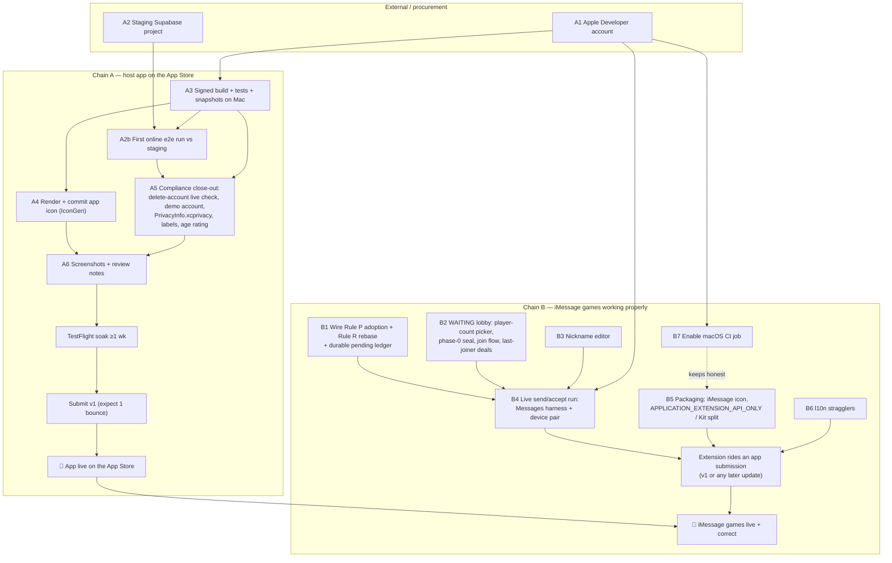

# iMessage app — ship blockers & the dependency chain to the App Store (2026-07-17)

*A from-the-tree audit of `main` (`8aec52e`) answering one question: **what still
stands between this repo and (a) the app being live on the App Store and (b)
iMessage games working properly?** Every claim below was verified against the
code on `main`, not summarized from older docs — several of the tracking docs
(`NEXT_STEPS.md`, `IOS_APP_DESIGN.md` §17.4, `ios/README.md`) lag the tree, and
§6 lists exactly where. Where a doc and the tree disagree, the tree wins and is
cited by `file:line`.*

---

## 0. TL;DR

The hard engineering is done and proven: the FMSG codec, the git-style
concurrency model (Rule P / Rule R), the playable bubble, the send path, the
`/m/` web fallback, and the FINISHED→replay funnel are all on `main` with C,
wasm-parity, and Swift tests green. The app builds and runs on a Mac
(2026-07-16 bring-up; the iMessage turn loop is iPhone-17-sim verified).

What remains is **not one blocker but two chains** that can run largely in
parallel:

- **Chain A — the App Store record.** The extension ships inside the host app
  (one app record, `cards.foolish.app`), so nothing reaches the store until the
  host app clears Milestone F: an **Apple Developer account** (the root
  dependency for signing, TestFlight, and the store record), a **staging
  Supabase project** for the first end-to-end online run
  (`ios/Config/*.xcconfig` is still blank), the **app icon actually rendered**
  (the asset slot is empty), screenshots, privacy labels, review notes, and a
  live verification of the already-merged `delete-account` function.
- **Chain B — iMessage games working properly.** Four real gaps, in dependency
  order: **(B1) the on-device concurrency layer is not wired** — `fio_msg_rule_p`
  / `fio_msg_rebase` exist and are tested but nothing in the extension calls
  them, so concurrent turns don't converge on device yet; **(B2) no N≥3
  lobby** — "New game" hard-codes a 2-player LIVE deal and the seal path cannot
  emit a WAITING bubble; **(B3) no nickname editor** — every creator ships as
  literally "Me"; **(B4) the live send/accept leg has never been run** in the
  Messages simulator harness. Plus packaging items that will fail review if
  untouched: **no iMessage app-icon asset**, `APPLICATION_EXTENSION_API_ONLY`
  still off while the extension links FoolishKit (which links supabase-swift),
  and no `PrivacyInfo.xcprivacy`.

The single most load-bearing external dependency is the **Apple Developer
account** — signing, TestFlight, the app record, macOS CI minutes, and the
store submission all queue behind it. The single most load-bearing *code* gap
is **B1**: without Rule P/R wired into the extension flow, the design's core
guarantee (deterministic convergence of concurrent moves) exists only in tests.

---

## 1. Where `main` actually stands

The status docs were written mid-stream and the tree has moved past them.
Verified state per layer:

| Layer | State | Evidence |
| --- | --- | --- |
| **C kernel & FMSG wire** | ✅ Done. `msg_wire.{h,c}` encodes/validates all four phases (WAITING/ACCEPT/LIVE/FINISHED), 2–8 players, seat-prefixed awire actions, 32-byte seed, SHA-256 `parent8`, Rule P + Rule R in C. Hostile-input tamper matrix green. | `c/src/msg_wire.h:103-106`, `c/src/msg_wire.c:77,98`, `c/tests/msg_wire_test.c` (incl. `test_waiting_phase` :295-309) |
| **wasm + e2e parity** | ✅ Done. `wasm_msg_encode/decode` exports, TS bridge, Rule P/R property tests + the §14 worked races, size guardrail. Runs on Linux CI on every push. | `e2e/msg_wire.test.ts`, `e2e/msg_concurrency.test.ts`, `.github/workflows/ios.yml` (bridge-linux job) |
| **`/m/` web fallback** | ✅ Done. Read-only spectator render of a live-game URL + install/play CTAs + OG unfurl metadata. | `src/app/m/[payload]/page.tsx`, `layout.tsx`, `e2e/msg_route.test.ts`, `e2e/msg_og.test.ts` |
| **iMessage extension — 2p happy path** | ✅ Done and sim-verified. Compact drawer, expanded real-board render, tap-to-play staged turns, undo, seal→`MSMessage` insert, `didStartSending` cache commit, seat identity (§6 cache → sender-inference → picker). | `ios/FoolishMessages/*`, `ios/FoolishKit/Messages/*`, `ios/FoolishTests/MessageTurnControllerTests.swift`, `SeatIdentityTests.swift` |
| **FINISHED → replay funnel** | ✅ Done. Terminal bubble carries `foolish.cards/<code>` (kernel picks v6 when re-derivable, else v5); joiners self-name on first reply. | `ios/FoolishMessages/MessagesViewController.swift:104-117`, `sdk/swift/MessageEnvelope.swift:70-72,211-218`, test `testFinishedGameProducesAReplayFunnelLink` |
| **Host iOS app** | ✅ Builds & runs on Mac (2026-07-16 bring-up, `IOS_APP_DESIGN.md` §17.10); offline play, replays (decode + transport), tutorial, settings, auth, online layer written with wire resolved. Online **runtime** never exercised against a real backend. | `docs/IOS_APP_DESIGN.md` §17.5, §17.10; `ios/Config/Base.xcconfig` (blank `SUPABASE_URL/KEY`) |
| **Backend prerequisites** | ✅ Both former blockers landed. Stale-round guard: `games.round_epoch` version fence + `REJECT_STALE_ROUND` in the TS edge layer (deliberately NOT the kernel, per the handoff spec), with iOS already sending `intent_version`. Account deletion: edge function + PII-scrub RPC + web page, wired to the Settings seam. | Guard: `server/impls/supabase/migrations/20260713120000_round_epoch_stale_guard.sql`, `functions/_shared/adapter/packed_action.ts:96-100`, `ios/FoolishKit/Net/PackedAction.swift:80-88`. Deletion: `functions/delete-account/index.ts`, `migrations/20260714120000_account_deletion.sql`, `AccountService.swift:25-29` |
| **CI** | ⚠️ Linux-only. The C bridge smoke, goldens freshness, FMSG/e2e suites, and architecture lint run on every push; the macOS `xcodebuild build test` job is **commented out** pending Milestone F (account/minutes). Nothing on CI compiles the Swift or validates extension packaging. | `.github/workflows/ios.yml:36-53` |

---

## 2. Two finish lines, one app record

The one-app-record decision (`IMESSAGE_GAME_DESIGN.md` §9.1, reflected in
`ios/project.yml:66-72`) means the extension **cannot ship before the host
app** — `FoolishMessages` is embedded in `Foolish` (`cards.foolish.app` +
`cards.foolish.app.MessagesExtension`). Two consequences:

1. Every App-Store blocker of the host app is transitively a blocker of the
   iMessage app. That's Chain A below.
2. The extension does **not** have to ride the app's *first* submission —
   shipping it later is a normal app update (verified platform fact,
   `IMESSAGE_IMPLEMENTATION_HANDOFF.md` §3.5). So Chain B gates "iMessage games
   on the store", but not "app on the store". If v1 ships app-only, Chain B
   collapses into a later 1.x update.

---

## 3. Chain A — what blocks the App Store record

In dependency order. Items A1–A2 are external/procurement; A3–A7 are work.

### A1. Apple Developer account — the root dependency ⛔

Nothing downstream moves without it: `DEVELOPMENT_TEAM` for signing
(`ios/project.yml:31-35` ships `CODE_SIGNING_ALLOWED: NO`), device builds,
TestFlight, the App Store Connect record, and enabling the macOS CI job.
Everything in `IOS_APP_DESIGN.md` §16.F assumes it exists.

### A2. Staging Supabase project + credentials ⛔ (for online in v1)

`ios/Config/Base.xcconfig` has **blank** `SUPABASE_URL`/`SUPABASE_KEY`; the
Debug/Release xcconfigs carry commented placeholders only. The online layer is
written and its wire is source-verified (`docs/IOS_APP_DESIGN.md` §17.5,
`docs/PROTOCOL.md`), but the first end-to-end run against a live backend has
never happened — PR #93 hit the same wall ("no staging Supabase project").
Provisioning staging is a prerequisite for the §17.6 step-5 runtime
verification, and §16.D's DoD forbids testing against prod.

*Escape hatch:* the code already degrades gracefully — with blank keys,
`Backend.swift:20-27` leaves `client = nil` and every online affordance
disables, so a v1 that ships offline+replays only is a config choice, not a
code change (and the §16 "4.2 substance" review story explicitly works without
an account). That would turn A2 into a 1.x follow-up — a product call.

### A3. First signed build + snapshot/test pass on a Mac

The app builds and runs in the simulator (§17.10), but: snapshot reference
images are still unrecorded (4 DesignSystem snapshot refs drift on the current
sim OS per the handoff STATUS), the full `xcodebuild test` matrix isn't in CI,
and signing has never been exercised. First Mac session with the account:
§17.6 steps 1–7.

### A4. App icon — the asset slot is empty ⛔ (submission-fatal, trivial to fix)

`ios/FoolishApp/Assets.xcassets/AppIcon.appiconset/Contents.json` declares the
1024×1024 slot with **no image file**. The procedural generator exists
(`ios/Tools/IconGen`, §17.6 step 7: `swift run --package-path ios/Tools/IconGen
icongen …`) — it just has to be run on a Mac and the PNG committed. App Store
validation rejects icon-less binaries at upload.

### A5. Compliance close-out (`ios/Compliance.md` TODO(F) items)

- **Account deletion** (Guideline 5.1.1(v)): the endpoint is merged
  (`server/impls/supabase/functions/delete-account/`) — verify once against a
  live DB, then fill the deletion-URL metadata field. Known rider: the
  `game_snapshots.extras` replay-name blob is not yet anonymized on deletion
  (documented in the migration) — decide whether that's acceptable for
  submission or schedule the replay re-encoding first.
- **Portal + record setup**: create the App Store Connect app record, register
  the bundle ids (`cards.foolish.app` + `.MessagesExtension`) and the App Group
  (`group.cards.foolish`) in the developer portal, confirm "Foolish — Durak"
  name availability (`Compliance.md:53`, fallbacks in review notes).
- Demo account credentials + committed demo replay code for the reviewer
  script; age-rating questionnaire (card game, no gambling → 4+/9+; confirm
  what chat, if any, ships — `Compliance.md:36`); privacy labels (no tracking,
  identifiers + user content linked).
- **`PrivacyInfo.xcprivacy` does not exist anywhere in `ios/`** — required for
  App Store submissions since the 2024 privacy-manifest mandate (UserDefaults
  access via the App Group cache is a "required-reason" API). One small file,
  but submission-fatal if missing.

### A6. Store assets + TestFlight soak

Screenshots (§16.F4: 6.7" + SE sizes, ru variants), review notes with the
60-second reviewer script, internal TestFlight ≥1 week (§16.F5), budget for
one rejection cycle ("first submission WILL likely bounce once").

### A7. Decide PR #93 (open work-in-flight, partially superseded)

PR #93 (`claude/ios-redesign`, 18 Mac-verified commits, `mergeable_state:
dirty` against today's main) predates the owner's 2026-07-16 "copy the web
layouts" decision (§17.10). What's **already on main by other routes** (no
loss in closing): the wool/wood/fern materials (`Materials.swift`,
`WoolTexture.swift`, `WoodTexture.swift`, `FernCardBack.swift`, via `7e34244`),
the 8-seat table (main's `TableView` ring supersedes #93's arc — parked by
owner decision), and functionally the `ios_goldens.c` buffer fix (main already
carries a 1 MB legal buffer at `c/ios/ios_goldens.c:81`, CI-freshness-checked).
What would be **lost if closed unmerged**: **drag-to-play** (zero drag-gesture
code on main — `TableView` is tap-select only), the **per-install unique
texture seed** (`TextureStore`/`ProceduralTextures`; main's textures are
deterministic, not per-player), a **rendered 1024² app icon** (jester-"Д" on
Khokhloma — note it's a *different design* from main's planned procedural
fern, so keeping it is a design choice, not a merge), the Mac-verified
snapshot references + drag UI test, and `docs/IOS_REDESIGN_HANDOFF.md`.
Cherry-pick what's wanted or close it — leaving it open just accrues conflict
debt against the rewired engine files (its `LocalGame.swift`/`Models.swift`
paths predate the `sdk/swift/` move).

---

## 4. Chain B — what blocks "iMessage games working properly"

Ranked by how much they block. B1–B4 are gameplay-correctness; B5–B7 are
packaging/review.

### B1. The concurrency layer is not wired on-device ⛔ (the core guarantee)

The design's whole point (§7 of `IMESSAGE_GAME_DESIGN.md`) is deterministic
convergence of concurrent turns: on opening a bubble, compare it against the
cached preferred chain with **Rule P**; if my staged/pending actions sit on a
losing chain, **Rule R** rebases the survivors. The C entry points exist, are
exposed to Swift, and are fixture-tested:

- `fio_msg_rule_p` / `fio_msg_rebase` wrapped by
  `MessageEnvelope.preferred(_:_:)` / `.rebase(...)` —
  `sdk/swift/MessageEnvelope.swift:222,240`.
- Property-tested in `e2e/msg_concurrency.test.ts` (Rule P total order,
  delivery-order independence, the §14 worked races) and in
  `c/tests/msg_wire_test.c`.

**But nothing in the extension calls either one.** The live flow adopts
whatever bubble was tapped, unconditionally
(`ios/FoolishMessages/MessagesRootView.swift:82-99`); `didReceive` merely
re-presents (`MessagesViewController.swift:39-42`); and the App-Group cache
field documented as "the preferred chain (URL body), for Rule P"
(`MessageGameStore.swift:29`) is **write-only** — grep shows it is stored at
both commit sites and read back nowhere. Concretely, today:

- Opening a **stale** bubble (an older chain in the same game) silently adopts
  it — no "this game has moved on" redirect to the preferred chain.
- A bubble arriving **while I'm mid-staging** rebuilds the UI and my staged
  moves are lost in memory rather than rebased (`pendingStage` lives only in
  the view controller; the §9.3 pending ledger was never built).
- The §7.5 pickup∥throw-in race resolves correctly in the *test suite* and not
  yet in the *product*.

Sequential turn-taking (the 2p happy path) works because every payload carries
the full chain. Anything concurrent — the actual multi-actor design point —
needs this wiring. It is bounded work: the primitives, the cache, and the
oracle fixtures all exist; what's missing is the Swift glue in
`MessagesRootView.load()` / `MessagesViewController.didReceive` plus a durable
pending ledger.

### B2. No N≥3 game creation — the WAITING lobby doesn't exist in the app ⛔

The wire, kernel, and tests fully support phase-0 lobbies
(`c/src/msg_wire.c:98`, `test_waiting_phase`), and 3p/4p chains decode fine in
Swift (`MessageEnvelopeTests.swift:25-29`). But the extension:

- hard-codes `players: 2` at genesis with no player-count picker
  (`MessagesRootView.swift:109-115`);
- can only seal phase LIVE(2) or FINISHED(3) — `phase: isOver ? 3 : 2`
  (`MessageTurnController.swift:144`); there is no path that emits a 0-action
  WAITING bubble (and `seal` would reject an empty body, `MSG_EBODY`);
- has no join-an-empty-seat flow — `SeatPicker` only offers already-named
  joins (`MessagesRootView.swift:134`), and the WAITING→LIVE "last joiner
  deals" transition (§5.2) has no implementation.

Until this lands, iMessage Durak is a 2-player DM game only. (A legitimate v1
scope call — but then group threads see a game they can't join, so the compact
drawer should say so.)

### B3. No nickname entry — everyone is "Me" ⛔ (small, but user-visible immediately)

`MessageGameStore.nickname` defaults to `"Me"` and nothing ever writes it
(`MessageGameStore.swift:62-65`; `SettingsView.swift` has no nickname field;
grep shows only reads + test setters). The self-naming *mechanism* works
(`sealJoins` appends your name on first act, tested), so the fix is one small
editor — expanded-presentation only, since compact is the keyboard area and
cannot show a text field (`IMESSAGE_IMPLEMENTATION_HANDOFF.md` §3.5).

### B4. The live send/accept leg has never been run 🔶 (verification, not code)

Everything up to `conversation.insert` is unit-proven, and the M3 turn loop is
sim-verified — but no one has yet driven the **Messages app harness** (two
simulator conversations): New game → play → Send → recipient taps → adopts →
replies. The Swift tests explicitly stop at Apple's plumbing
(`MessageTurnControllerTests.swift:4-5`). This is the acceptance test for M3
(`IMESSAGE_GAME_DESIGN.md` §19) and the first thing a Mac session should do;
follow with a physical device pair (§17.12 warns sim/device timing differs).

### B5. Extension packaging will fail review as-is ⛔

Three concrete items, all invisible to the Linux-only CI:

1. **No iMessage app icon.** `FoolishMessages/` has no `.xcassets` at all and
   the target sets no `ASSETCATALOG_COMPILER_APPICON_NAME`
   (`ios/project.yml:84-109`). Messages extensions need the dedicated
   MessagesAppIcon set (27×20-ish wide-format slots) — upload validation
   rejects without it. Extend `IconGen` to render the wide format.
2. **`APPLICATION_EXTENSION_API_ONLY` is off** for FoolishKit, deferred to
   "Milestone G" by a comment written before the extension existed
   (`ios/project.yml:139-142`) — but the extension links FoolishKit **today**,
   and FoolishKit links the Supabase SDK (`project.yml:124-129`). That means
   app-only API use inside the framework is currently un-policed by the
   compiler, and the extension drags a network stack it must never use
   (§17.5's memory-ceiling rule: SwiftUI + libfoolish only) into its process.
   Either flip the flag and fix fallout, or split an extension-safe
   FoolishKitCore (Engine/DesignSystem/Boards) out from Net/.
3. **No `PrivacyInfo.xcprivacy`** (shared with A5 — the extension's App-Group
   UserDefaults use is a required-reason API).
4. **The extension's `Info.plist` lacks `ITSAppUsesNonExemptEncryption`** —
   the app target declares it (`ios/FoolishApp/Info.plist:31-32`) but
   `ios/FoolishMessages/Info.plist` ends at the `NSExtension` dict. The
   extension is a separate binary; add the key before it ships.

### B6. Localization stragglers 🔶 (polish)

The `ios.msg.*` strings are trilingual (en/ru/ko) in `FStrings.swift` — M4 is
substantively done — but the read-only board twin was missed:
`MessageBoardView.swift:47,56` hard-code "no battle" / "… is the fool" /
"game over", and `MessageTableView.swift:100` hard-codes its game-over line.
The `Localizable.xcstrings` catalog itself remains deferred (E4).

### B7. No Mac CI = packaging regressions stay invisible 🔶

Until the macOS job in `.github/workflows/ios.yml:36-53` is enabled (needs the
A1 account or paid minutes), nothing compiles `FoolishMessages`, runs the
Swift tests, or validates entitlements/plists/icons on push. Every Chain-B
merge until then is verified only by whoever has the Mac. Worth enabling the
same week as A1.

---

## 5. The dependency graph

Readings of the graph worth making explicit:

- **B1–B3 need no Mac and no account.** They are Swift work against
  already-proven C primitives, testable with the existing XCTest oracles
  (extend `MessageTurnControllerTests` with Rule-P/rebase fixtures ported from
  `e2e/msg_concurrency.test.ts`, per the M3 plan). They can start today, in
  parallel with procurement.
- **A1 unlocks four things at once** (signing, TestFlight, store record, macOS
  CI) — procure it first; everything else on Chain A is days, not weeks, once
  it exists.
- **The two chains join only at submission.** If the owner wants the store
  presence sooner, ship v1 app-only and land the extension in 1.x — the
  platform explicitly supports adding an extension in an update.

## 6. Things that look like blockers but aren't (stale docs & issues)

| Stale claim | Reality on `main` |
| --- | --- |
| `NEXT_STEPS.md` §3: "iMessage: design 100%, code 0%" (2026-07-15) | M0–M3 shipped + sim-verified; FINISHED funnel + joiner self-naming landed after the 07-17 STATUS too. |
| `ios/README.md` / `IOS_APP_DESIGN.md` §17.4: "Swift never compiled / needs first xcodebuild" | The app was brought up on a Mac 2026-07-16 (§17.10), build/run green in the simulator; M3 verified on an iPhone-17 sim. |
| `ios/README.md` external deps: stale-round guard + account deletion "must land" | Both merged: `20260713120000_round_epoch_stale_guard.sql` + `intent_version`; `delete-account` function + `20260714120000_account_deletion.sql` (§17.2). Only the live-DB verification remains. |
| Issue #10: five deleted edge functions still invoked → 404 | The client now routes `update-name` / `rearrange-*` / `join` through `meta` (`src/contexts/ServerContext.tsx:986-1065`), and `create` exists as a function again (`server/impls/supabase/functions/create/`). The issue can be closed after a prod-deploy check. |
| `IMESSAGE_IMPLEMENTATION_HANDOFF.md` NEXT items 3 & 4 both open | Item 4 (FINISHED replay link) landed (`5568dd3`); item 3's *naming* half landed (`0ac7df7`) — the lobby half (B2) is what remains. |
| PR #99 (bot localization) listed as open in `NEXT_STEPS.md` | Merged/contained; only #93 is still open. |
| `solver_difftest` failing `make difftests` (#56) & `pass_parity` (#57) | Real but pre-existing and unrelated to either chain — housekeeping, not gating. |

## 7. Suggested order of work

1. **Start procurement now (A1 + A2)** — Apple Developer account and a staging
   Supabase project. Both are wall-clock waits that gate everything else on
   Chain A.
2. **In parallel, do B1 (concurrency wiring) first among the code work** — it
   is the correctness core, it needs no Mac, and its oracle fixtures already
   exist. Then **B2 (WAITING lobby)**, then **B3 (nickname editor)** — B3 is
   trivial but touches the same seal path, so ride it on B2's PR.
3. **First Mac-with-account session:** §17.6 steps 1–7 + render both icons
   (A4, B5.1) + record snapshots + run **B4** (Messages-harness send/accept,
   then a device pair) + flip/resolve `APPLICATION_EXTENSION_API_ONLY` (B5.2)
   + add `PrivacyInfo.xcprivacy` (A5/B5.3) + enable the macOS CI job (B7).
4. **Online runtime verification vs staging (A2b)** and the account-deletion
   live check; decide the v1 scope call (online in v1 vs offline-first).
5. **Store assets, TestFlight soak, submit (A6)** — with the extension if
   Chain B finished in time, without it otherwise (it ships in any later
   update).
6. Close out the stale trackers along the way: close #10 after a deploy check,
   close-or-cherry-pick #93 (drag-to-play + icon are its surviving value),
   quarantine `solver_difftest` (#56) so `make difftests` is trustworthy again.

## 8. Kernel work explicitly *not* on either chain

For scoping clarity, the remaining `C_CORE_CONSOLIDATION.md` items (A1 server
cutover, A5 replay-steps-from-kernel, A6–A8) block **neither** chain. A5 is the
one with user-visible payoff nearby — it turns the iOS replay screen's
event-stream playback into full board playback (`ReplaysView.swift:7-10`
documents the gap) — worth doing for app-quality before submission, but the
store does not depend on it. Same for card-flight animation (Milestone B
remainder) and camera QR scan: quality, not gates.
