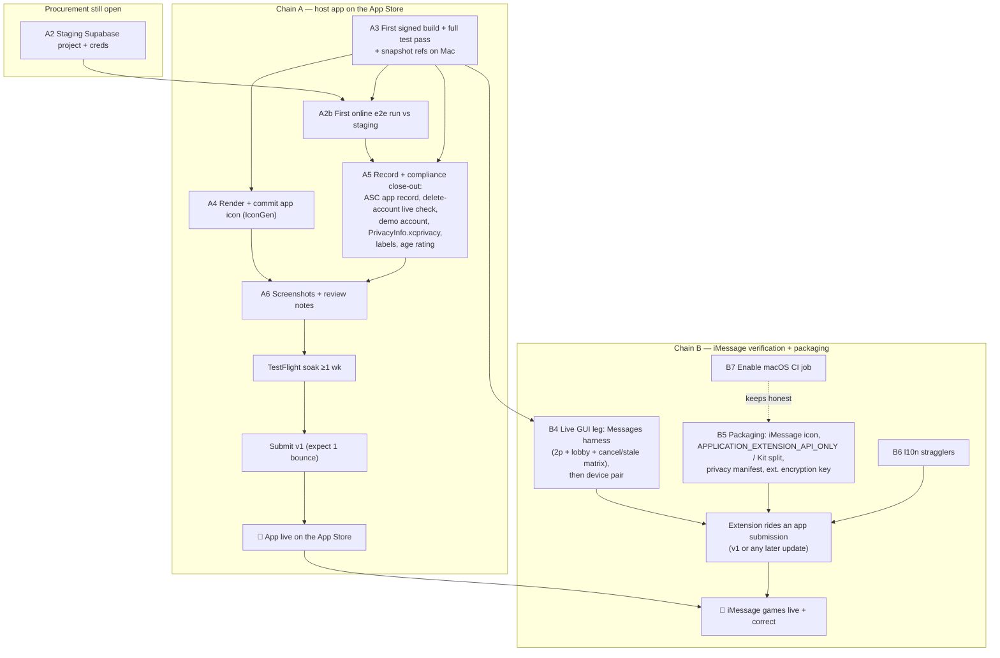

# iMessage app — ship blockers & the dependency chain to the App Store (2026-07-17)

*A from-the-tree audit of `main` answering one question: **what still stands
between this repo and (a) the app being live on the App Store and (b) iMessage
games working properly?** Every claim below was verified against the code on
`main`, not summarized from older docs — several of the tracking docs
(`NEXT_STEPS.md`, `IOS_APP_DESIGN.md` §17.4, `ios/README.md`) lag the tree, and
§6 lists exactly where. Where a doc and the tree disagree, the tree wins and is
cited by `file:line`.*

> **Revision 2 — same day, later (main `6719a81`).** The first revision of this
> doc (audited at `8aec52e`) listed Chain B items B1–B3 as the open code gaps.
> **They have since landed** (`e52955f` + `bb602f2`), B4 gained a protocol-level
> full-game proof (`8d7ebb5`), and Milestone-F signing is configured with a real
> team (`8aafbbf`, `19a5d16`). Chain B is now a *verification* chain, not a
> build chain. Sections §4–§7 are rewritten to match; struck-through history is
> not kept — see git for the prior revision.

---

## 0. TL;DR

The engineering for "iMessage games working properly" is now **built end to
end**: the FMSG codec, the git-style concurrency model (Rule P / Rule R) —
now wired into the extension flow with a durable pending ledger — the N≥3
WAITING lobby, nickname entry, the playable bubble, the send path, the `/m/`
web fallback, and the FINISHED→replay funnel are all on `main` with C,
wasm-parity, and Swift tests green (30 message-suite tests), plus a
protocol-level proof that drives a complete 2-player game through the
send/accept leg (`e2e/msg_full_game.test.ts`: 59 turns, 0 hand leaks,
bubbles ≤108 B). Milestone-F signing is configured with a real team ID.

What remains splits into **verification** and **submission mechanics**:

- **Chain A — the App Store record.** The extension ships inside the host app
  (one app record, `cards.foolish.app`). Signing is configured
  (`DEVELOPMENT_TEAM` set, Automatic); still open: a **staging Supabase
  project** for the first end-to-end online run (`ios/Config/*.xcconfig` is
  still blank), the **app icon actually rendered** (the asset slot is empty),
  `PrivacyInfo.xcprivacy`, screenshots, privacy labels, the App Store Connect
  record + metadata, TestFlight, and a live verification of the merged
  `delete-account` function.
- **Chain B — iMessage verification + packaging.** The B1–B3 code gaps are
  closed; what's left is **(B4) the live Messages-harness run** — the
  simulator's two-participant GUI pass and then a device pair, per
  `IMESSAGE_MAC_RUNBOOK.md` (the protocol underneath is now covered by
  automated tests; Apple's transport + the SwiftUI render are the untested
  remainder) — and the **packaging items that will fail review if
  untouched**: no iMessage app-icon asset, `APPLICATION_EXTENSION_API_ONLY`
  still off while the extension links FoolishKit (which links supabase-swift),
  no `PrivacyInfo.xcprivacy`, no encryption key in the extension's Info.plist.

The critical path has inverted since revision 1: the load-bearing items are no
longer code but **provisioning and store mechanics** — staging credentials,
the two icons, the privacy manifest, the app record — plus one honest
verification pass on the Messages harness before calling B4 done.

---

## 1. Where `main` actually stands

The status docs were written mid-stream and the tree has moved past them.
Verified state per layer:

| Layer | State | Evidence |
| --- | --- | --- |
| **C kernel & FMSG wire** | ✅ Done. `msg_wire.{h,c}` encodes/validates all four phases (WAITING/ACCEPT/LIVE/FINISHED), 2–8 players, seat-prefixed awire actions, 32-byte seed, SHA-256 `parent8`, Rule P + Rule R in C. Hostile-input tamper matrix green. | `c/src/msg_wire.h:103-106`, `c/src/msg_wire.c:77,98`, `c/tests/msg_wire_test.c` (incl. `test_waiting_phase` :295-309) |
| **wasm + e2e parity** | ✅ Done. `wasm_msg_encode/decode` exports, TS bridge, Rule P/R property tests + the §14 worked races, size guardrail. Runs on Linux CI on every push. | `e2e/msg_wire.test.ts`, `e2e/msg_concurrency.test.ts`, `.github/workflows/ios.yml` (bridge-linux job) |
| **`/m/` web fallback** | ✅ Done. Read-only spectator render of a live-game URL + install/play CTAs + OG unfurl metadata. | `src/app/m/[payload]/page.tsx`, `layout.tsx`, `e2e/msg_route.test.ts`, `e2e/msg_og.test.ts` |
| **iMessage extension — 2p happy path** | ✅ Done and sim-verified. Compact drawer, expanded real-board render, tap-to-play staged turns, undo, seal→`MSMessage` insert, `didStartSending` cache commit, seat identity (§6 cache → sender-inference → picker). | `ios/FoolishMessages/*`, `ios/FoolishKit/Messages/*`, `ios/FoolishTests/MessageTurnControllerTests.swift`, `SeatIdentityTests.swift` |
| **iMessage extension — concurrency, lobby, nicknames (B1–B3)** | ✅ Landed (`e52955f`, `bb602f2`). Rule P runs on every bubble open against the cached preferred chain — a stale bubble shows a "moved on" banner instead of silently adopting; a durable round-tagged pending ledger in the App Group mirrors every stage/undo and is rebased (Rule R via `fio_msg_rebase_awire`) onto an adopted winner, survivors auto-staged, discards toasted. New-game setup has a name field + 2–4 player picker; N≥3 seals a phase-0 WAITING lobby, joiners claim the lowest free seat, the last claim seals the LIVE handoff. Nickname persisted to the App Group. | `ios/FoolishMessages/MessagesRootView.swift:121-127` (Rule P), `:214-296` (adopt/rebase), `:138-183` (lobby), `ios/FoolishKit/Messages/MessageGameStore.swift` (ledger), `c/src/msg_wire.c` (0-action seal in `msg_seal`); tests `MessageConcurrencyTests.swift`, `MessageLobbyTests.swift` (30 message-suite tests green) |
| **B4 — send/accept leg, protocol level** | ✅ Proven headlessly: a complete 2p game driven seat-by-seat through the envelope wire — decode(=replay-validate) → assert the PUBLIC bubble hides every hand → play → rebase(REAPPLY) → reseal → FINISHED terminal enforced by the kernel. 59 turns, 0 hand leaks, bubble ≤108 B. Covers everything the GUI harness would **except Apple's transport + the SwiftUI render**. | `e2e/msg_full_game.test.ts` (`8d7ebb5`) |
| **FINISHED → replay funnel** | ✅ Done. Terminal bubble carries `foolish.cards/<code>` (kernel picks v6 when re-derivable, else v5); joiners self-name on first reply. | `ios/FoolishMessages/MessagesViewController.swift:104-117`, `sdk/swift/MessageEnvelope.swift:70-72,211-218`, test `testFinishedGameProducesAReplayFunnelLink` |
| **Host iOS app** | ✅ Builds & runs on Mac (2026-07-16 bring-up, `IOS_APP_DESIGN.md` §17.10); offline play, replays (decode + transport), tutorial, settings, auth, online layer written with wire resolved. Online **runtime** never exercised against a real backend. | `docs/IOS_APP_DESIGN.md` §17.5, §17.10; `ios/Config/Base.xcconfig` (blank `SUPABASE_URL/KEY`) |
| **Backend prerequisites** | ✅ Both former blockers landed. Stale-round guard: `games.round_epoch` version fence + `REJECT_STALE_ROUND` in the TS edge layer (deliberately NOT the kernel, per the handoff spec), with iOS already sending `intent_version`. Account deletion: edge function + PII-scrub RPC + web page, wired to the Settings seam. | Guard: `server/impls/supabase/migrations/20260713120000_round_epoch_stale_guard.sql`, `functions/_shared/adapter/packed_action.ts:96-100`, `ios/FoolishKit/Net/PackedAction.swift:80-88`. Deletion: `functions/delete-account/index.ts`, `migrations/20260714120000_account_deletion.sql`, `AccountService.swift:25-29` |
| **CI** | ⚠️ Linux-only. The C bridge smoke, goldens freshness, FMSG/e2e suites, and architecture lint run on every push; the macOS `xcodebuild build test` job is **commented out** pending Milestone F (account/minutes). Nothing on CI compiles the Swift or validates extension packaging. | `.github/workflows/ios.yml:36-53` |

---

## 2. Two finish lines, one app record

The one-app-record decision (`IMESSAGE_GAME_DESIGN.md` §9.1, reflected in
`ios/project.yml:66-72`) means the extension **cannot ship before the host
app** — `FoolishMessages` is embedded in `Foolish` (`cards.foolish.app` +
`cards.foolish.app.MessagesExtension`). Two consequences:

1. Every App-Store blocker of the host app is transitively a blocker of the
   iMessage app. That's Chain A below.
2. The extension does **not** have to ride the app's *first* submission —
   shipping it later is a normal app update (verified platform fact,
   `IMESSAGE_IMPLEMENTATION_HANDOFF.md` §3.5). So Chain B gates "iMessage games
   on the store", but not "app on the store". If v1 ships app-only, Chain B
   collapses into a later 1.x update.

---

## 3. Chain A — what blocks the App Store record

In dependency order. Items A1–A2 are external/procurement; A3–A7 are work.

### A1. Apple Developer account — ✅ resolved (signing configured)

The account exists and signing is wired: `CODE_SIGN_STYLE: Automatic` +
`DEVELOPMENT_TEAM` set in `ios/project.yml:36-37` (`8aafbbf`), and
`FoolishTests` gained a generated Info.plist so the test bundle signs too
(`19a5d16`). Remaining uses of the account are downstream items, not this
one: the App Store Connect record (A5), TestFlight (A6), and macOS CI
minutes (B7).

### A2. Staging Supabase project + credentials ⛔ (for online in v1)

`ios/Config/Base.xcconfig` has **blank** `SUPABASE_URL`/`SUPABASE_KEY`; the
Debug/Release xcconfigs carry commented placeholders only. The online layer is
written and its wire is source-verified (`docs/IOS_APP_DESIGN.md` §17.5,
`docs/PROTOCOL.md`), but the first end-to-end run against a live backend has
never happened — PR #93 hit the same wall ("no staging Supabase project").
Provisioning staging is a prerequisite for the §17.6 step-5 runtime
verification, and §16.D's DoD forbids testing against prod.

*Escape hatch:* the code already degrades gracefully — with blank keys,
`Backend.swift:20-27` leaves `client = nil` and every online affordance
disables, so a v1 that ships offline+replays only is a config choice, not a
code change (and the §16 "4.2 substance" review story explicitly works without
an account). That would turn A2 into a 1.x follow-up — a product call.

### A3. Full signed build + snapshot/test pass on a Mac

The app builds and runs in the simulator (§17.10), signing is configured
(A1), and the message suites have run green (30 tests per `e52955f`; the
`FoolishTests` Info.plist fix in `19a5d16` is evidence a signed test pass was
exercised). Still open: snapshot reference images unrecorded (4 DesignSystem
refs drift on the current sim OS per the handoff STATUS), no archive/TestFlight
build yet, and none of it is reproducible in CI (B7). Note for the next Mac
session: `e52955f` added new C symbols — run `make ios-lib` before building.

### A4. App icon — the asset slot is empty ⛔ (submission-fatal, trivial to fix)

`ios/FoolishApp/Assets.xcassets/AppIcon.appiconset/Contents.json` declares the
1024×1024 slot with **no image file**. The procedural generator exists
(`ios/Tools/IconGen`, §17.6 step 7: `swift run --package-path ios/Tools/IconGen
icongen …`) — it just has to be run on a Mac and the PNG committed. App Store
validation rejects icon-less binaries at upload.

### A5. Compliance close-out (`ios/Compliance.md` TODO(F) items)

- **Account deletion** (Guideline 5.1.1(v)): the endpoint is merged
  (`server/impls/supabase/functions/delete-account/`) — verify once against a
  live DB, then fill the deletion-URL metadata field. Known rider: the
  `game_snapshots.extras` replay-name blob is not yet anonymized on deletion
  (documented in the migration) — decide whether that's acceptable for
  submission or schedule the replay re-encoding first.
- **Portal + record setup**: create the App Store Connect app record, register
  the bundle ids (`cards.foolish.app` + `.MessagesExtension`) and the App Group
  (`group.cards.foolish`) in the developer portal, confirm "Foolish — Durak"
  name availability (`Compliance.md:53`, fallbacks in review notes).
- Demo account credentials + committed demo replay code for the reviewer
  script; age-rating questionnaire (card game, no gambling → 4+/9+; confirm
  what chat, if any, ships — `Compliance.md:36`); privacy labels (no tracking,
  identifiers + user content linked).
- **`PrivacyInfo.xcprivacy` does not exist anywhere in `ios/`** — required for
  App Store submissions since the 2024 privacy-manifest mandate (UserDefaults
  access via the App Group cache is a "required-reason" API). One small file,
  but submission-fatal if missing.

### A6. Store assets + TestFlight soak

Screenshots (§16.F4: 6.7" + SE sizes, ru variants), review notes with the
60-second reviewer script, internal TestFlight ≥1 week (§16.F5), budget for
one rejection cycle ("first submission WILL likely bounce once").

### A7. Decide PR #93 (open work-in-flight, partially superseded)

PR #93 (`claude/ios-redesign`, 18 Mac-verified commits, `mergeable_state:
dirty` against today's main) predates the owner's 2026-07-16 "copy the web
layouts" decision (§17.10). What's **already on main by other routes** (no
loss in closing): the wool/wood/fern materials (`Materials.swift`,
`WoolTexture.swift`, `WoodTexture.swift`, `FernCardBack.swift`, via `7e34244`),
the 8-seat table (main's `TableView` ring supersedes #93's arc — parked by
owner decision), and functionally the `ios_goldens.c` buffer fix (main already
carries a 1 MB legal buffer at `c/ios/ios_goldens.c:81`, CI-freshness-checked).
What would be **lost if closed unmerged**: **drag-to-play** (zero drag-gesture
code on main — `TableView` is tap-select only), the **per-install unique
texture seed** (`TextureStore`/`ProceduralTextures`; main's textures are
deterministic, not per-player), a **rendered 1024² app icon** (jester-"Д" on
Khokhloma — note it's a *different design* from main's planned procedural
fern, so keeping it is a design choice, not a merge), the Mac-verified
snapshot references + drag UI test, and `docs/IOS_REDESIGN_HANDOFF.md`.
Cherry-pick what's wanted or close it — leaving it open just accrues conflict
debt against the rewired engine files (its `LocalGame.swift`/`Models.swift`
paths predate the `sdk/swift/` move).

---

## 4. Chain B — iMessage games working properly

Revision-2 status: **B1–B3 landed** (`e52955f` + the `bb602f2` kernel
refactor); they move from "build" to "verify on the Messages harness". B4 is
half-closed (protocol proven, GUI leg open). B5–B7 are unchanged and are now
the substantive remainder.

### B1. Concurrency wiring — ✅ landed, verify in the harness

What revision 1 flagged is now implemented exactly along the recommended seam:

- **Rule P on every open**: `MessagesRootView.load()` compares the tapped
  chain against the cached preferred chain via
  `MessageKernel.shared.preferred` — a losing bubble shows the "moved on"
  banner (Open latest / View anyway) instead of silently adopting
  (`MessagesRootView.swift:121-127`, stale view at `:438+`).
- **Durable pending ledger**: staged moves mirror into the App Group
  per-game, round-tagged, on every stage/undo; cleared on send-commit
  (`MessageGameStore.swift`). A bubble arriving mid-staging can now rebase
  instead of losing your moves.
- **Rule R rebase**: adopting a winner replays the ledger through
  `fio_msg_rebase_awire` (a new JSON-free entry — the phone stages awire, so
  the ledger holds awire); survivors auto-stage, discards surface as a toast
  (`MessagesRootView.swift:214-296`).
- **Tests**: `MessageConcurrencyTests.swift` is the Swift twin of
  `e2e/msg_concurrency.test.ts` (Rule P/R + ledger).

Remaining: the §7.5 pickup∥throw-in race and the stale-bubble banner should be
*seen once* in the two-participant harness (`IMESSAGE_MAC_RUNBOOK.md` §3.4) —
the logic is now product code, but no human has watched it fire in Messages.

### B2. N≥3 WAITING lobby — ✅ landed, verify in the harness

New-game setup has a 2–4 player picker; N≥3 seals a **phase-0 WAITING**
bubble seating only the creator (`msg_seal` now accepts a 0-action body —
`bb602f2` folded the empty seal into the kernel and taught `msg_replay` that
a 0-action deal is the whole state); joiners claim the lowest free seat and
reseal WAITING; the claim that fills the last seat seals the LIVE handoff and
drops into the board (`MessagesRootView.swift:138-183`, `LobbyView`;
`MessageLobbyTests.swift` covers seal→join→LIVE). Verify per runbook §3.3b.

### B3. Nickname entry — ✅ landed

Name fields in `NewGameSetup` and the lobby join, persisted to the App Group
(`MessagesRootView.swift:87-88,142-147`; `MessageGameStore.nickname` now has
a setter). iMessage-only by design — the live app's unique username is a
separate system.

### B4. The send/accept leg — 🔶 protocol proven; the live GUI leg remains

`e2e/msg_full_game.test.ts` (`8d7ebb5`) now drives a **complete 2p game**
through the envelope wire exactly as the extension does — decode(=replay) →
assert the PUBLIC bubble hides every hand → play a legal move →
rebase(REAPPLY) → reseal — to a kernel-enforced FINISHED terminal (59 turns,
0 hand leaks, bubbles ≤108 B; it caught a real finished-sealed-as-LIVE bug on
first run). What that deliberately does **not** cover: Apple's
`MSMessage`/`MSConversation` transport and the SwiftUI board render. The
remaining B4 work is the interactive pass — `IMESSAGE_MAC_RUNBOOK.md` Part 3
(two-participant simulator harness: 2p game, lobby flow §3.3b, cancel/cache
matrix §3.4), then Part 4 (device pair; §17.12 warns timing differs).

### B5. Extension packaging will fail review as-is ⛔

Three concrete items, all invisible to the Linux-only CI:

1. **No iMessage app icon.** `FoolishMessages/` has no `.xcassets` at all and
   the target sets no `ASSETCATALOG_COMPILER_APPICON_NAME`
   (`ios/project.yml:84-109`). Messages extensions need the dedicated
   MessagesAppIcon set (27×20-ish wide-format slots) — upload validation
   rejects without it. Extend `IconGen` to render the wide format.
2. **`APPLICATION_EXTENSION_API_ONLY` is off** for FoolishKit, deferred to
   "Milestone G" by a comment written before the extension existed
   (`ios/project.yml:139-142`) — but the extension links FoolishKit **today**,
   and FoolishKit links the Supabase SDK (`project.yml:124-129`). That means
   app-only API use inside the framework is currently un-policed by the
   compiler, and the extension drags a network stack it must never use
   (§17.5's memory-ceiling rule: SwiftUI + libfoolish only) into its process.
   Either flip the flag and fix fallout, or split an extension-safe
   FoolishKitCore (Engine/DesignSystem/Boards) out from Net/.
3. **No `PrivacyInfo.xcprivacy`** (shared with A5 — the extension's App-Group
   UserDefaults use is a required-reason API).
4. **The extension's `Info.plist` lacks `ITSAppUsesNonExemptEncryption`** —
   the app target declares it (`ios/FoolishApp/Info.plist:31-32`) but
   `ios/FoolishMessages/Info.plist` ends at the `NSExtension` dict. The
   extension is a separate binary; add the key before it ships.

### B6. Localization stragglers 🔶 (polish)

The `ios.msg.*` strings are trilingual (en/ru/ko) in `FStrings.swift` — M4 is
substantively done — but the read-only board twin was missed:
`MessageBoardView.swift:47,56` hard-code "no battle" / "… is the fool" /
"game over", and `MessageTableView.swift:100` hard-codes its game-over line.
The `Localizable.xcstrings` catalog itself remains deferred (E4).

### B7. No Mac CI = packaging regressions stay invisible 🔶

Until the macOS job in `.github/workflows/ios.yml:36-53` is enabled (needs the
A1 account or paid minutes), nothing compiles `FoolishMessages`, runs the
Swift tests, or validates entitlements/plists/icons on push. Every Chain-B
merge until then is verified only by whoever has the Mac. Worth enabling the
same week as A1.

---

## 5. The dependency graph

Done since revision 1 (removed from the graph): Apple Developer account +
signing config (A1), and the whole Chain-B build wave (B1 concurrency wiring,
B2 WAITING lobby, B3 nickname entry) plus the protocol half of B4.

Readings of the graph worth making explicit:

- **Everything left on Chain B routes through one Mac session** — B4's GUI
  leg, the two icons, the snapshot refs, the extension-API-only flip, and
  enabling macOS CI are all `IMESSAGE_MAC_RUNBOOK.md` work. There is no
  Linux-side blocker left on Chain B.
- **A2 (staging Supabase) is the only procurement item still open**, and only
  if online ships in v1 — the offline escape hatch in A2 still stands.
- **The two chains join only at submission.** If the owner wants the store
  presence sooner, ship v1 app-only and land the extension in 1.x — the
  platform explicitly supports adding an extension in an update. Given B1–B3
  landed, the gap between the two options is now days, not weeks.

## 6. Things that look like blockers but aren't (stale docs & issues)

| Stale claim | Reality on `main` |
| --- | --- |
| `NEXT_STEPS.md` §3: "iMessage: design 100%, code 0%" (2026-07-15) | M0–M3 shipped + sim-verified; FINISHED funnel + joiner self-naming landed after the 07-17 STATUS too. |
| `ios/README.md` / `IOS_APP_DESIGN.md` §17.4: "Swift never compiled / needs first xcodebuild" | The app was brought up on a Mac 2026-07-16 (§17.10), build/run green in the simulator; M3 verified on an iPhone-17 sim. |
| `ios/README.md` external deps: stale-round guard + account deletion "must land" | Both merged: `20260713120000_round_epoch_stale_guard.sql` + `intent_version`; `delete-account` function + `20260714120000_account_deletion.sql` (§17.2). Only the live-DB verification remains. |
| Issue #10: five deleted edge functions still invoked → 404 | The client now routes `update-name` / `rearrange-*` / `join` through `meta` (`src/contexts/ServerContext.tsx:986-1065`), and `create` exists as a function again (`server/impls/supabase/functions/create/`). The issue can be closed after a prod-deploy check. |
| `IMESSAGE_IMPLEMENTATION_HANDOFF.md` NEXT items 2–4 open | ALL landed now: item 4 (FINISHED replay link, `5568dd3`), item 2 (nickname entry, `e52955f`), item 3 (N≥3 WAITING lobby, `e52955f`). Only NEXT item 1 (the live Messages-harness run) remains — this doc's B4. |
| This doc's own revision 1: "B1–B3 are the open code gaps" | Closed by `e52955f`/`bb602f2` the same day (see the revision-2 banner). |
| PR #99 (bot localization) listed as open in `NEXT_STEPS.md` | Merged/contained; only #93 is still open. |
| `solver_difftest` failing `make difftests` (#56) & `pass_parity` (#57) | Real but pre-existing and unrelated to either chain — housekeeping, not gating. |

## 7. Suggested order of work

1. **Provision the staging Supabase project (A2)** — the one procurement item
   still open, and only needed if online ships in v1.
2. **One Mac session clears nearly everything else** (follow
   `IMESSAGE_MAC_RUNBOOK.md`, which was updated for the B1–B3 landing):
   `make ios-lib` (the new C symbols require a fresh xcframework) →
   full build+test → run **B4's GUI leg** (2p game, §3.3b lobby flow, §3.4
   cancel/stale/rebase matrix, then a device pair) → render both icons (A4,
   B5.1) → record snapshot refs → flip/resolve
   `APPLICATION_EXTENSION_API_ONLY` (B5.2) → add `PrivacyInfo.xcprivacy` +
   the extension's encryption key (B5.3/B5.4) → enable the macOS CI job (B7).
3. **Online runtime verification vs staging (A2b)** and the account-deletion
   live check; decide the v1 scope call (online in v1 vs offline-first).
4. **App Store Connect record + metadata (A5), screenshots (A6), TestFlight
   soak, submit** — with the extension if B4/B5 cleared in time, without it
   otherwise (it ships in any later update).
5. Close out the stale trackers along the way: close #10 after a deploy check,
   close-or-cherry-pick #93 (drag-to-play + icon are its surviving value),
   quarantine `solver_difftest` (#56) so `make difftests` is trustworthy again.

## 8. Kernel work explicitly *not* on either chain

For scoping clarity, the remaining `C_CORE_CONSOLIDATION.md` items (A1 server
cutover, A5 replay-steps-from-kernel, A6–A8) block **neither** chain. A5 is the
one with user-visible payoff nearby — it turns the iOS replay screen's
event-stream playback into full board playback (`ReplaysView.swift:7-10`
documents the gap) — worth doing for app-quality before submission, but the
store does not depend on it. Same for card-flight animation (Milestone B
remainder) and camera QR scan: quality, not gates.

Likewise new-but-not-gating: the **WatchFoolish watchOS scaffold** landed
(`67c15e0`, W1 — target + placeholder app in `ios/WatchUI/`, not yet embedded
in the phone app per its project.yml comment). The watch plan explicitly ships
after Milestone F (`IOS_APP_DESIGN.md` §17.9); it shares FoolishKit but blocks
neither chain.
