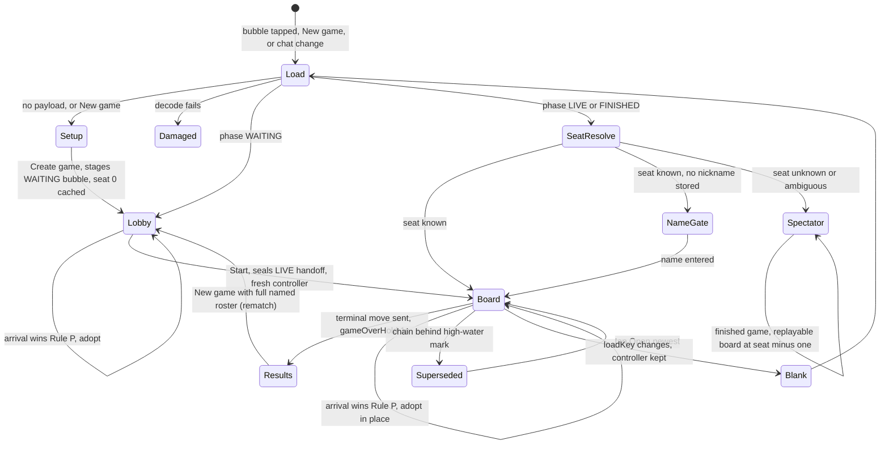
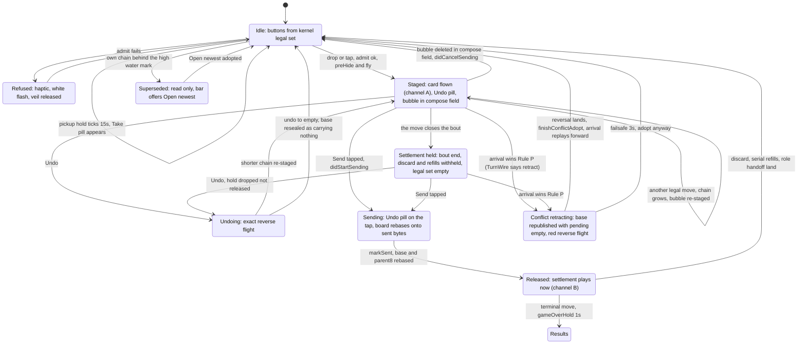
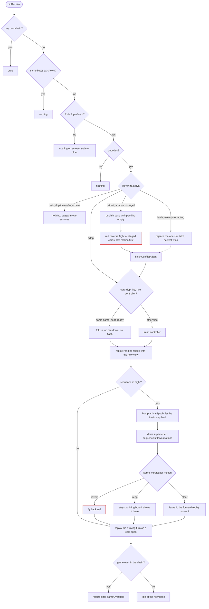
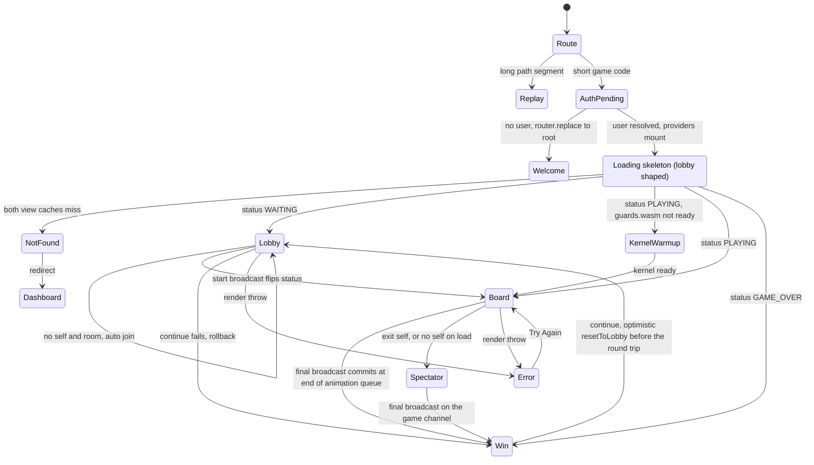
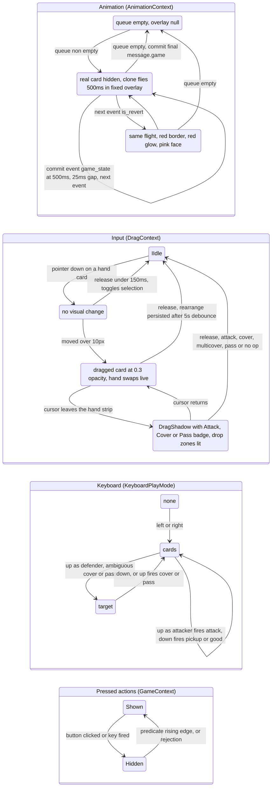
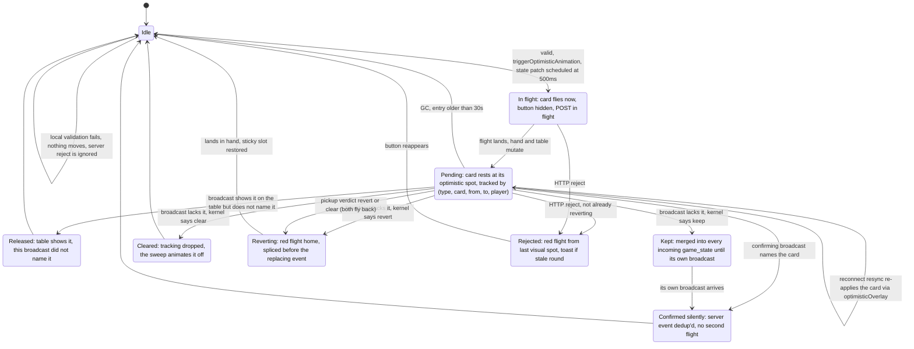
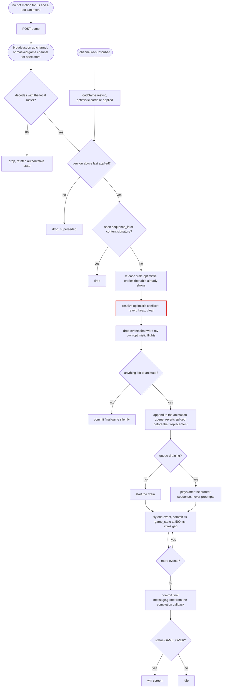

# UI state flows: iMessage vs web

How the *visible* board can change on each client, drawn as state machines.
Two clients, two truths: on iMessage the thread's newest bubble is the game and
nothing is authoritative until a human presses Send; on the web the server's
`games.version` is the game and every local move is a prediction the server
will confirm, contradict, or sweep away. Both clients animate optimistically
and both revert in red, but *why* a card flies home differs, and that is the
last section.

Every state and edge below is read from the code on 2026-09-07. Where a design
doc disagrees with the code, the code wins. Anchors are `file:line`.

---

## Part 1: iMessage

### 1.1 Surfaces

The extension has no screen enum. `GameSurface.expandedContent` picks the first
screen whose guard holds, in this order
(`ios/FoolishKit/Messages/MessagesRootView.swift:920-1092`): board, lobby, name
gate, setup, seat picker (DEBUG), spectator, damaged, blank wool. Routing comes
from `MessageSurfaceRouter.resolve`
(`ios/FoolishKit/Messages/MessageSurfaceRouter.swift:52-65`).

Compact and expanded are **not** branches of this machine. One `GameSurface`
renders both presentation styles, sized by live geometry
(`MessagesRootView.swift:296-345`); the only things that read the height are
the send-hint and the opponent-ring radius via `collapseFraction`
(`ios/FoolishKit/Boards/MessageTableView.swift:1412`).

Anchors: setup to lobby `MessagesRootView.swift:1388-1450`; join/exit/passing
`:1487-1584`, `:1629-1681`; start `:1742-1758`; rematch `:1349-1375`; adopt
`:718-762`; superseded bar and Open newest `:649-681`; name gate `:1843-1846`,
`:1955-1961`; seat ambiguity `:1850-1902`; reload keeps the controller
`:1115-1128`; results after `settleResults` `MessageTableView.swift:3307-3313`.

Two host-level transitions ride over the top of this machine:

- **Auto-collapse after staging.** From expanded, a staged move waits 250 ms,
  then `BoardAnimator.waitForSettle` (so the flight lands first), then 500 ms,
  then requests compact and inserts the bubble only after `didTransition`
  (`ios/FoolishMessages/MessagesViewController.swift:565-603`). The tween
  itself is 0.38 s (`MessagesRootView.swift:253-267`) and blocks flight aiming
  while it runs (`MessageTableView.swift:3356-3383`).
- **Send from expanded dismisses the extension; send from compact keeps the
  drawer open** (`MessagesViewController.swift:237`).

### 1.2 The board: one move, from tap to thread

There is no mode enum on the board either. The visible state is the product of
the controller's flags, `pending` (staged moves), `sending`, `settlementHeld`,
`conflictRetracting`, `superseded`, `pickupHold`
(`ios/FoolishKit/Messages/MessageTurnController.swift:67-76`, `:323`, `:429`,
`:481`, `:643`), and the board's animator ownership (`sequenceDepth`,
`animSequenceToken`, `arrivalEpoch`, `MessageTableView.swift:435-506`).

The diagram below is the lifecycle of a single local move. The three animation
channels named on the edges are the catalogue's
(`docs/ANIMATION_CATALOGUE.md`): **A** plays the action half on the tap, **B**
plays the withheld settlement half on Send, and undo plays A backwards.

What each edge does on screen:

- **Idle to Staged.** `playAt` snapshots takeoff rects, pre-hides the played
  cards and shows a resting ghost in the same frame
  (`MessageTableView.swift:5116-5211`), then `play` freezes the counts and,
  for pickup or good, keeps the table drawn as a sweep so it never blinks empty
  (`:4838-4862`). `controller.apply` admits through `TurnWire.admit`, appends to
  `pending`, and `captureSettlement` cuts a bout-ending turn at the kernel's
  settlement boundary (`MessageTurnController.swift:1109-1142`, `:390-416`).
  The board's `onChange(of: controller.view)` flies the placement
  (`MessageTableView.swift:2134-2323`). Staging seals base plus pending into a
  bubble and inserts it; insert only stages, it never sends
  (`MessageTurnController.swift:1561`, `MessagesViewController.swift:447-603`).
- **Staged to Sending to Released.** `didStartSending` commits the cache
  synchronously (just-sent marker, seat, high-water chain,
  `MessagesViewController.swift:187`, `:636-657`) and bumps `sentToken`; the
  surface calls `markSending` at once (the Undo pill goes on the tap, not after
  the rebase) then `markSent`, which rebases base, parent8, joins and boundary
  and releases the held settlement (`MessagesRootView.swift:572-586`,
  `MessageTurnController.swift:1211-1297`, `:1456-1478`). Nothing re-animates
  the move itself; only the withheld discard, refills and role flights play
  (`MessageTableView.swift:2289-2292`). A send handed the wrong bytes still
  releases the hold and clears `sending`, but rebases nothing
  (`MessageTurnController.swift:1359-1455`).
- **Undo.** `undo` drops the last pending move in one assignment, drops the
  hold, sets `lastChangeWasUndo` (`MessageTurnController.swift:1487-1519`).
  The board routes that into `flyUndoReturn` (table to hand) or
  `flyUndoRelease` (hand back to the table, for an undone pickup)
  (`MessageTableView.swift:2263-2281`, `:3491`, `:3622`). Undo to empty
  re-seals the base with `MSG_NEW_NOTHING` (`:5011-5018`).
- **Refused.** `rejectTick` plays a haptic and white flash and
  `releaseLivePlayVeil` reveals the pre-hidden cards again
  (`MessageTableView.swift:783-798`, `:4936-4978`).
- **Conflict retract.** See 1.3.

### 1.3 Arrivals: a bubble lands while the board is open

`didReceive` drops my own chain coming back (`StagedBubbleRouting.isMine`,
`MessagesViewController.swift:173`), otherwise hands the bytes to the surface
through `incomingToken`; Apple never moves `selectedMessage`, so this is the
only channel a live arrival has (`MessagesRootView.swift:594`, `:697-717`).

Anchors: `maybeAdoptIncoming` `MessagesRootView.swift:718-762`; `adopt` and
seat resolution `:1773-1940`; `canAdopt` `MessageTurnController.swift:631`;
`offerArrival` verdicts and the retraction `:697-800`; `finishConflictAdopt`
and the 3 s failsafe `:668`, `:785`; `publish` raising `replayPending`
`:1040-1058`; board picks it up at `MessageTableView.swift:2142`, `:2284`;
mid-animation epoch and reversal `:4622-4639`, `:3722-3758`; the verdicts as
flights `ios/FoolishKit/Boards/ConflictModel.swift:49-64`; the red tint on the
ghost only `ios/FoolishKit/Boards/BoardFlight.swift:465-492`.

Three rules worth stating in words:

- **Bursts are not a queue.** Several arrivals in quick succession reverse
  whatever is animating and play only the last one; intermediate boards are
  never shown (`MessageTableView.swift:4622`).
- **The board never renders new base with old staged moves, not for one
  frame.** That is why the retraction is published against the *old* base and
  the arrival is adopted only after the red flight lands
  (`MessageTurnController.swift:690-696`).
- **Clear beats revert.** If the arriving chain already contains my staged
  card (their cover or pickup took it), it must not fly home first; the forward
  replay owns it. This is the "put a card down, someone picked it up, it flew
  back to my hand" flicker, avoided on both clients.

The five lagging display values (deck, discard, per-seat counts, out set, role
marks) live in `ShownLedger` and can only be written by the sequence that owns
the animator (`ios/FoolishKit/Boards/ShownLedger.swift:56-118`, `:244-253`).
`FlightRecorder` writes breadcrumbs for every adopt, send, rebase and conflict
to the App Group and raises the health banner on the next launch if the last
run ended badly (`ios/FoolishKit/Messages/FlightRecorder.swift:81-118`).

### 1.4 Timers

| Timer | Where | What moves |
| --- | --- | --- |
| Post-stage collapse: 250 ms, waitForSettle (8 s cap), 500 ms | `MessagesViewController.swift:565-567` | drawer down to Messages' Send |
| Collapse tween 0.38 s, released after 1.2 s | `MessagesRootView.swift:259-294` | box height |
| Pickup hold 15 s, ticks once a second | `MessageTurnController.swift:1071-1084` | Take pill appears by itself |
| Flight 0.5 s plus 25 ms gap, boutEndHold 1.5 s, gameOverHold 1.0 s | `BoardFlight.swift:21-69` | every card motion |
| Conflict failsafe 3 s | `MessageTurnController.swift:668` | adopts the latch if the board dies mid-flight |
| Send-hint arrow 3 s fuse | `MessageTableView.swift:5513-5518` | hint fades |

No bots run inside the extension; auto-play exists only under DEBUG harness
flags (`MessagesRootView.swift:1263`).

---

## Part 2: Web

### 2.1 Surfaces

The `/:game_id` route renders a replay directly for a long base32 segment and
otherwise mounts the protected provider tree
(`src/app/[game_id]/page.tsx:16-26`). Inside it, `GameView` picks a screen
from the loaded game's `status` (`src/components/GameView.tsx:40-62`).

Anchors: auth gate `src/components/ProtectedRoute.tsx:20-52`; load and the
not-found throw `src/contexts/ServerContext.tsx:150-169`, `:623-661`; auto join
and spectator subscription `:690-717`; game over committed from the queue's
completion callback `src/contexts/AnimationContext.tsx:991-1023`; optimistic
continue and rollback `src/components/WinScreen.tsx:120-126`,
`ServerContext.tsx:1133-1153`, mirror in `src/state/clientReconcile.ts:19-41`;
exit to spectator `ServerContext.tsx:517-552`; error boundary
`src/components/ErrorBoundary.tsx:142-191`.

Spectating is a mode of the board, not a screen: `game.self` is null, the hand
and buttons are gone and `ActionButtons` says Spectating
(`src/components/GameDisplay/ActionButtons.tsx:54-56`, `:179-181`).

### 2.2 The board: four orthogonal machines

The board (`src/components/GameBoard.tsx:74-109`) is one composition whose look
is the product of four independent machines. They compose: you can be
mid-drag while the animation queue is draining, and a pressed button can be
hidden while a revert flies.

Anchors: animation machine `AnimationContext.tsx:1237-1362`, overlay
`src/components/GameDisplay/AnimationOverlay.tsx:245-579`, card hidden while
flying `src/components/GameDisplay/CardFace.tsx:112-117`; drag machine
`src/contexts/DragContext.tsx:165-382`, badge
`src/components/GameDisplay/DragShadow.tsx:28-59`, drop zones
`src/components/GameDisplay/TableBattles.tsx:35-68`; keyboard
`src/components/GameDisplay/KeyboardPlayMode.tsx:218-304`, `:355-363`; pressed
actions `src/contexts/GameContext.tsx:24-26`, `ActionButtons.tsx:160-194`.

### 2.3 The optimistic path: one move, from tap to verdict

Every input (drop, click, key) funnels into `AnimationContext.attack`, `pass`,
`pickup` or `cover` (`AnimationContext.tsx:1451`, `:1529`, `:1605`, `:1671`).
The POST is fired first, stamped with the last applied authoritative version
as `intent_version` (`ServerContext.tsx:1209-1217`,
`src/state/authoritativeVersion.ts:12-27`), then the same bytes are validated
locally against `guards.wasm`; only a locally valid move animates.

The edges in detail:

- **Idle to In flight.** `triggerOptimisticAnimation` queues a client event
  that flies hand to table (or table to hand for pickup) exactly like a server
  event, and records the card in `optimisticAnimations` and
  `optimisticCardPositions` (`AnimationContext.tsx:1405-1442`). A pass also
  records the predicted defender rotation (`:1554-1561`). `ServerContext`
  applies the state mutation at `ANIMATION_TIME` so the hand and table change
  as the card lands (`ServerContext.tsx:768-912`). The rendered hand is a
  sticky-slot selector, so a card that leaves and comes back keeps its place
  (`clientReconcile.ts:127-147`).
- **Confirmed silently.** When the confirming broadcast arrives, each server
  event whose every card matches an optimistic entry under the same
  `(type, card, from, to, player)` key is dropped from the queue and untracked;
  if all events were optimistic the state is committed with no animation at
  all (`AnimationContext.tsx:932-969`). This is the "never animate my own
  card twice" rule.
- **Released.** Cards the authoritative table shows but this broadcast does
  not name were confirmed by a broadcast the version gate dropped; they are
  released without animating (`:879-899`, `src/state/optimisticAnimation.ts`,
  delegating to `anim_stale_optimistic_on_table` in C).
- **Kept, cleared, reverted.** `resolveOptimisticConflicts`
  (`AnimationContext.tsx:330-757`) asks the C animation core
  (`anim_conflict_verdict`, marshalled by `src/state/optimisticConflicts.ts`)
  for a verdict per pending card. Keep merges the card into every `game_state`
  in the message (`:678-753`); clear drops tracking and lets the broadcast's
  pickup or trash sweep move it (`:640-645`); revert queues a red flight home.
  Pickup verdicts revert *and* clear both fly back, because the card is in my
  hand and the sweep runs from the table (`:565-619`).
- **Revert ordering.** Revert events are spliced immediately before the
  replacing attack, pickup or `magic_transition` so the retraction and the
  replacement read as one beat (`:1189-1227`), and each revert carries a
  synthetic `game_state` that still shows the cards where they were so nothing
  teleports (`:1071-1169`).
- **Rejected.** An HTTP rejection queues a revert from the card's last visual
  location unless conflict detection already reverted or cleared it
  (`:1484-1526` and siblings). `REJECT_STALE_ROUND` also raises the 4 s toast
  (`ServerContext.tsx:1231-1239`, `src/components/GameDisplay.tsx:22-33`).

### 2.4 Remote arrivals

Anchors: materialisation and refetch `AnimationContext.tsx:766-852`; version
gate `:869-874` via `clientReconcile.ts:55-56` and C
`anim_should_drop_stale`; dedup `:93-110`, `:905-922`; queue drain
`:1237-1370`; the authoritative final state is held until the queue empties
`:991-1024`, `:1249-1254`; dashboard pushes skip the on-screen game for the
same reason `ServerContext.tsx:351-356`; resync on resubscribe
`src/state/RealtimeAnimationFeed.tsx:92-104` and the overlay re-apply
`ServerContext.tsx:639-645`, `clientReconcile.ts:155-168`; bot bump
`AnimationContext.tsx:241-291`.

What an arrival does to the other machines:

- **While dragging:** nothing interrupts the drag. The hand under it can
  shrink, so `reorderHand` and `isHandPermutation` no-op on out-of-range
  indices and the keyboard cursor clamps (`clientReconcile.ts:95-125`,
  `KeyboardPlayMode.tsx:101-103`).
- **While a queue drains:** the new sequence is appended. There is no
  preemption and no "newest wins"; every intermediate board is shown.
- **Out of order or skipped versions:** a lower version is dropped, a gap is
  simply jumped, because every sequence carries its full resulting state.

### 2.5 Timers

| Timer | Where | What moves |
| --- | --- | --- |
| Flight 500 ms plus 25 ms gap | `AnimationContext.tsx:1308-1362`, `constants.ts:2` | one card, then its state commit |
| Optimistic state patch at 500 ms | `ServerContext.tsx:768` | hand and table mutate as the card lands |
| Bot bump every 5 s | `AnimationContext.tsx:241-291` | a bot move animates |
| Optimistic GC every 5 s, entries older than 30 s | `AnimationContext.tsx:294-314` | orphaned pending cards stop suppressing server events |
| Channel retry 500 ms to 5 s backoff, resync on re-subscribe | `RealtimeAnimationFeed.tsx:113-134` | a catch-up jump |
| Rearrange debounce 5 s | `DragContext.tsx:375-381` | server persist, rollback on error |
| Stale-round toast 4 s, chat bubble 8 s | `ServerContext.tsx:93`, `PlayerRing.tsx:124-132` | notices |

No polling fallback and no auto-pass timer exist on the web client.

---

## Part 3: The same red flight, two different reasons

Both clients use the same three-way verdict from the C animation core
(`c/src/anim_plan.h`, revert / keep / clear), the same rule that a retraction
is a reversed motion and never a cut, and the same red tint
(`rgb(220,38,38)`). What differs is the source of truth that triggers it.

| | iMessage | Web |
| --- | --- | --- |
| What is authoritative | the newest bubble the device can see, chosen by Rule P | `games.version`, monotonic, chosen by the server's CAS commit |
| When a local move becomes real | when the human presses Send in Messages | when the server commits the POST |
| What optimism means | the move is applied locally and *staged*; the bubble sits in the compose field until Send | the move is applied locally and the POST is already in flight |
| Bout-ending move | action half plays now, settlement half is *withheld* until Send (the human could still undo) | everything plays now; the server's own settlement events are dedup'd against the optimistic ones |
| Undo | a first-class action: reverse flight, shorter chain re-staged | none; the only way back is a rejection or a conflict |
| Why a card flies home red | an arriving chain is a sibling or descendant that does not contain my staged move (retract), or a superseded sequence's motion the newest chain disowns | the confirming broadcast does not show my card and the kernel says revert, or the server rejected the POST |
| Rebase | the board rebases onto the chain it adopts, so a cleared card never needs a flight | no rebase, so a cleared optimistic *pickup* must fly back to the table before the sweep |
| Several updates at once | reverse what is animating, play only the last (no queue) | append, never preempt, show every intermediate board |
| Stale intent across a round boundary | Rule P prefers the higher round; the losing move is superseded and the player is told | `intent_version` on the POST, `REJECT_STALE_ROUND`, toast |
| Duplicate of what is shown | no conflict, staged move survives | dropped by sequence id or content signature |
| Recovery from a missed update | the next bubble carries the whole chain; nothing to recover | REST resync on re-subscribe, with the optimistic overlay re-applied |
