# Foolish iMessage Extension — App Store Pre-Submission Review (Report 3)

**Reviewer:** Adversarial pre-submission pass (hands-on, driven in iOS 26.3 Simulator, iPhone 17 Pro)
**Date:** 2026-07-25
**What was exercised:** The `FoolishHarness` dev host (renders the real `MessagesRootView`) for 2-player and 6-player tables, plus the **actual shipping iMessage extension** launched inside Messages to confirm the harness is representative.

---

## Verdict

**Would not pass as-is without a verification pass; no hard crash-blockers, but two things must be resolved first.** Across a large number of interactions (create/join, 2p and 6p tables, rapid taps, rotation, largest Dynamic Type, longest nickname) I saw **no crashes, hangs, or beach-balls** — a good baseline. However, an adversarial reviewer or a first-time user hits two serious problems: (1) I observed a **duplicate playing card on screen** (the trump `9♠` under the deck was also sitting in my own hand) in a 6-player deal — if that reproduces in production dealing it is a correctness ship-blocker; and (2) the **compact presentation** (the default state a real iMessage app opens in) **clips content**: at 6 players one opponent seat is pushed off-screen and the primary **"Start playing" button is unreachable** unless the user discovers an unlabeled drag-to-expand gesture. On top of that, the whole product reads as **visually loud and unfinished** because of a hot-pink/magenta wool background that fights the cards and the low-contrast game markers. Everything else is polish. Ship-blockers: the duplicate-card verification and the compact "Start playing" reachability. The rest is MAJOR/MINOR/NIT UX.

> Note on scope: the harness's own top chrome (the `FoolishHarness — NOT the shipping extension` bar, `log`/`New`/player-count controls, `you are:` seat toggle, `Add player (testing)`) is **dev-only and does not ship**, so its glitches are excluded from the ranking below except where explicitly called out. The board, lobby, nickname screen, cards, and background **are** shipping surfaces — confirmed identical in the real extension (see finding 10).

---

## Ranked findings

### 1. MAJOR (potential BLOCKER) — Duplicate card visible on the table (6-player deal)
**Screen/state:** 6-player game, freshly dealt, expanded board.
**Observed:** The trump card shown under the deck is the **9 of spades**, and the **9 of spades is also the second card in my own hand**. The same physical card appears in two places at once.
**Why it matters:** A duplicated card is a game-integrity defect — it means a player can hold a card that is still "in the deck," which corrupts legal-move logic and trust in the game. Visible on the primary play surface. For a card game this is the kind of defect that gets called out in reviews and refunds.
**Caveat / must-verify:** This was seen in a harness game populated with `Add player (testing)` Solo bots. I could not confirm whether the production server deal produces the same result or whether the test-deal path bypasses the real dealer. **This must be reproduced against a real dealt game before ship.** If it reproduces, it is a hard blocker.
**Repro:** New game → 6p → add 5 players → Start → expand board → compare the trump under the deck with your hand.

Trump under the deck is `9♠`:

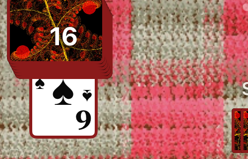

The same `9♠` is in my hand (card 2):

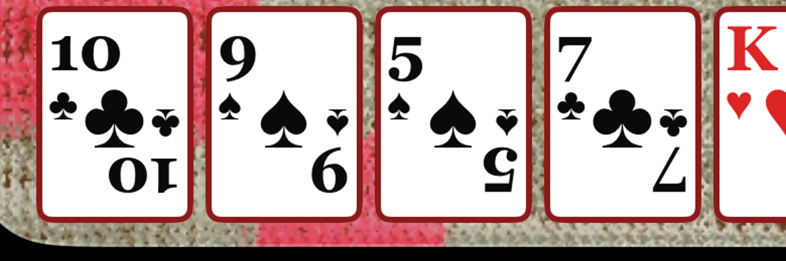

Full board for context:

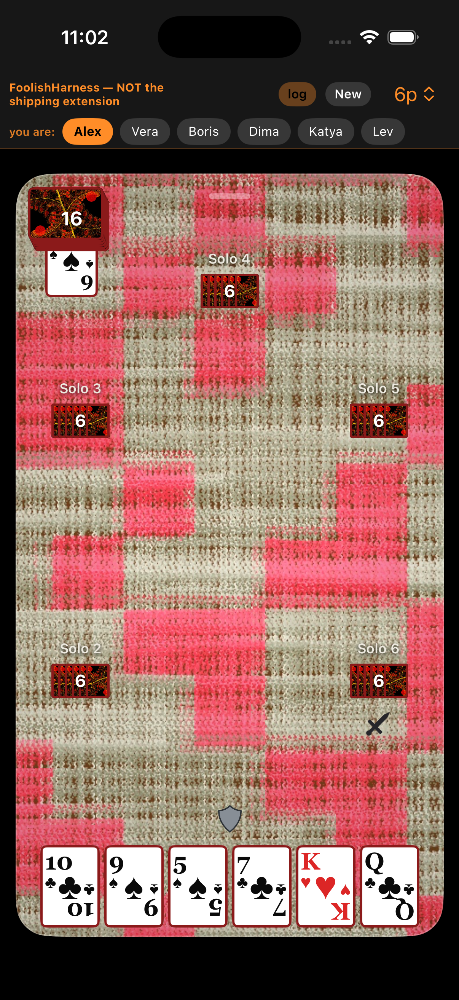

---

### 2. MAJOR — Compact presentation clips a player seat and the primary CTA; expand affordance is undiscoverable
**Screen/state:** 6-player lobby and table in the **compact** presentation (the state an iMessage app opens in by default).
**Observed:**
- In the 6-player **lobby**, the `Start playing` button is drawn below the bottom edge of the compact area and is **cut off / not tappable**; the lobby list does **not** scroll to bring it into view. The only way to reach it is to drag the board upward to expand it — and that grabber (a tiny horizontal pill at the top of the board) has no label or hint.
- In the 6-player **table**, one opponent seat ("Solo 3", left) is **clipped off-screen** in compact and only appears after expanding.
**Why it matters:** iMessage extensions present compact-first. A user who never discovers the expand gesture cannot start a 6-player game and cannot see all opponents. Apple review routinely rejects flows where a primary action is off-screen/unreachable. This is the closest thing to a functional blocker after the duplicate card.
**Repro:** New game → 6p → add 5 players. `Start playing` is clipped (below). Compare compact vs expanded table.

`Start playing` clipped at the bottom of the compact lobby (does not scroll):

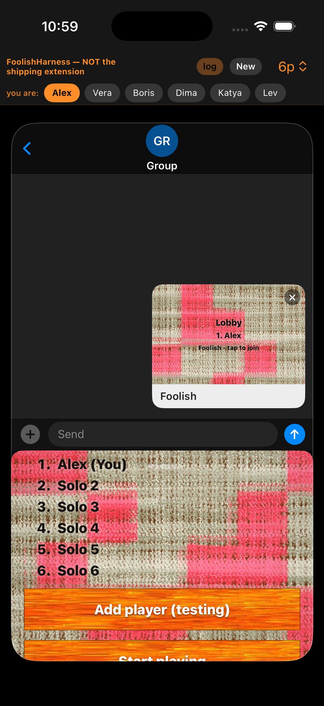

After dragging the board up to expand, the button is reachable:

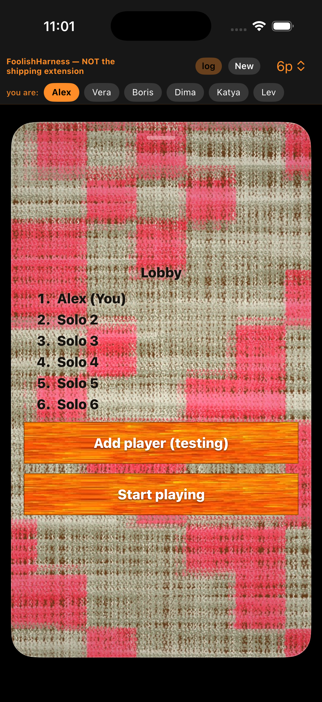

Compact table — only 4 opponents visible, "Solo 3" is missing:

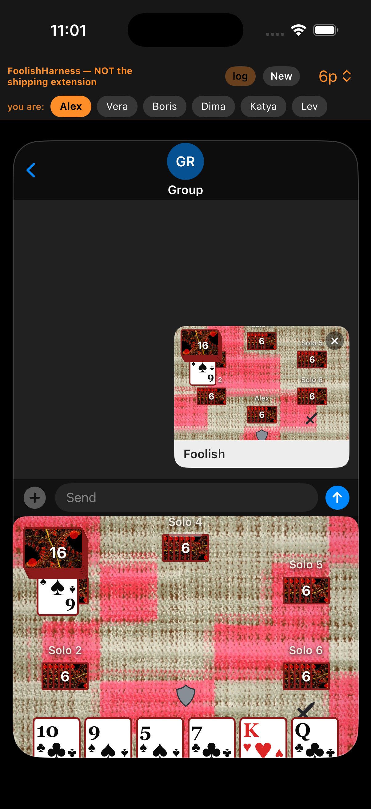

Expanded table — all 5 opponents (Solo 2-6) present:

---

### 3. MAJOR — Hot-pink/magenta wool background reads as garish and fights the content
**Screen/state:** Every screen (nickname, lobby, board) — confirmed on the real extension too.
**Observed:** The background is a loud pink/magenta-and-cream plaid wool. It is extremely high-energy, clashes with the dark-red fern card backs and the red suit pips, and makes the board look busy and unfinished. The white player-name labels ("Solo 2", "Lobby") and the small grey sword/shield markers sit directly on this noisy texture with weak contrast.
**Why it matters:** First-impression quality. This is not a subtle taste issue — the pink is aggressive enough that it undermines the otherwise nice wood/card artwork and hurts legibility of overlaid UI. It is the single biggest reason the app reads as "not done." UX quality, and a soft accessibility/contrast concern for the overlaid markers.
**Repro:** Any screen.

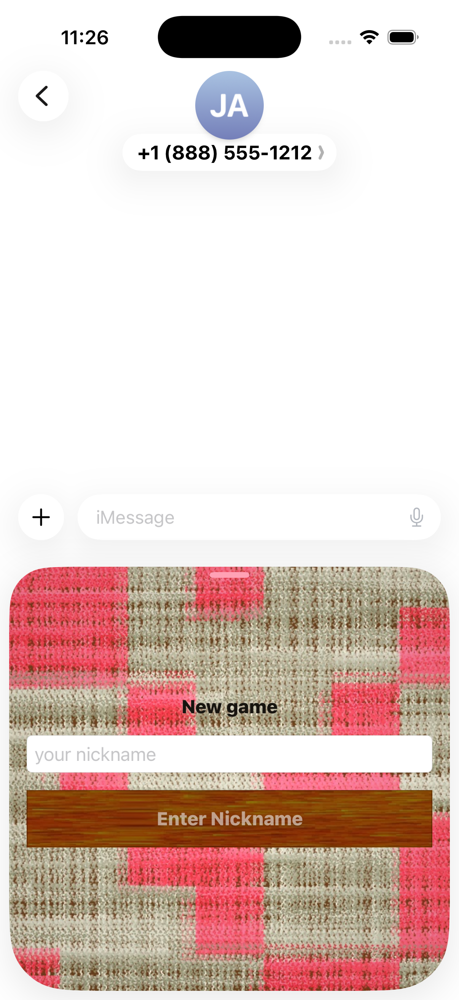

---

### 4. MINOR — Turn/role state is communicated only by tiny low-contrast sword/shield icons
**Screen/state:** In-game board (2p and 6p).
**Observed:** Whose turn it is, and who is attacker vs defender, is conveyed only by a small grey crossed-swords icon and a small grey shield icon placed near a seat. There is no explicit "Your turn" / "Waiting for Solo 2…" text or highlight. I repeatedly could not tell from the board alone whether it was my turn (and got a "That move isn't allowed" toast when guessing wrong).
**Why it matters:** New players will not know what to do. For a turn-based game the current turn should be unmistakable. UX clarity + the markers are low-contrast on the pink.
**Repro:** Start any game and try to read whose turn it is.

The one clear feedback that does exist is the illegal-move toast (good), but it is the *only* turn signal:

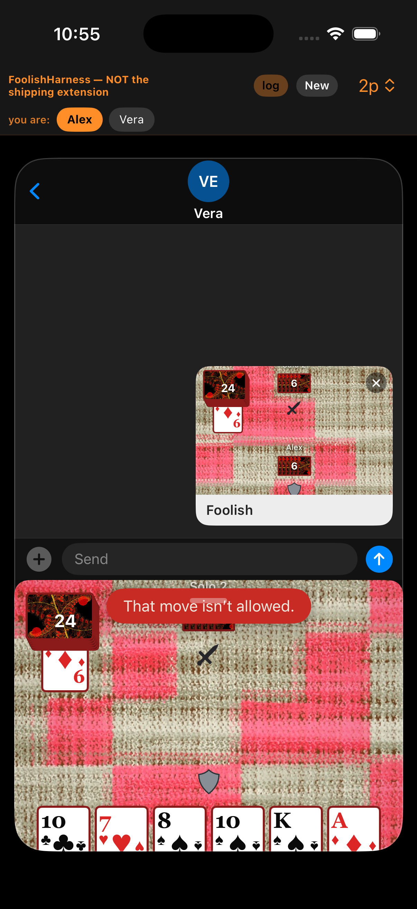

---

### 5. MINOR — Hand cards sit under the home-indicator safe area in compact; tap targets cramped
**Screen/state:** In-game, compact presentation.
**Observed:** In compact the player's hand is pinned to the very bottom of the board, with the lower portion of the cards running into the home-indicator region and the rounded screen corners. The effective tap area for each card is squeezed and the bottom pips are partially clipped.
**Why it matters:** Apple's 44pt minimum hit target and safe-area guidance. Grabbing/playing a card in compact is fiddly; expanding fixes it but see finding 2 about discoverability.
**Repro:** Start a game, stay compact, look at the hand row.

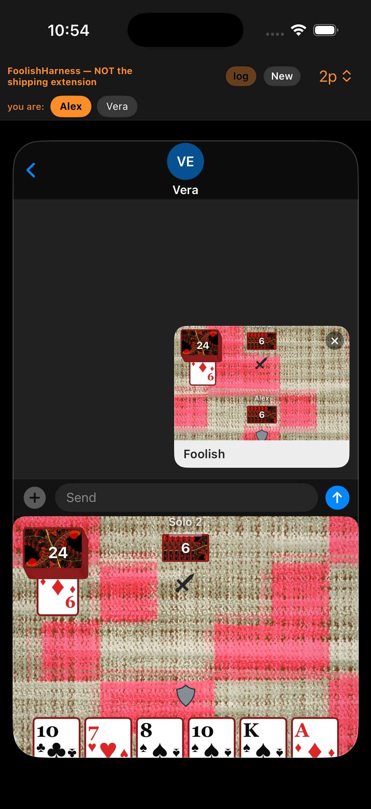

---

### 6. MINOR — Card ranks/pips do not respond to Dynamic Type
**Screen/state:** In-game board at the largest accessibility text size.
**Observed:** Text labels ("New game", "Lobby", "Solo N", buttons) scale correctly with Dynamic Type and stay unclipped — good. But the **cards themselves are fixed-size graphics**: at the largest accessibility size the rank/suit on each card stays exactly the same small size.
**Why it matters:** The most important information in a card game (your card ranks) is exactly what a low-vision user cannot enlarge. Accessibility (Dynamic Type) is a common review focus. Not a clipping bug, but an accessibility gap.
**Repro:** Settings → largest accessibility text (or `simctl ui booted content_size accessibility-extra-extra-extra-large`) → open a game.

Nickname screen scales fine:

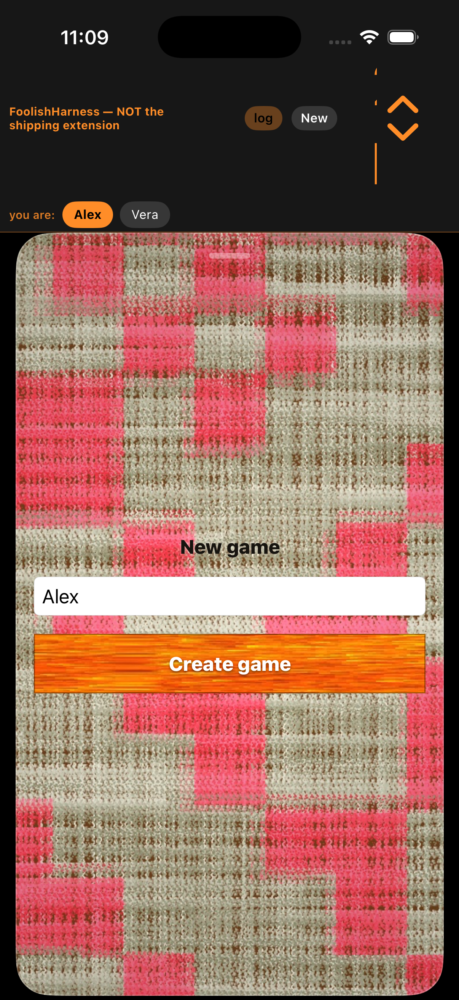

Board at largest Dynamic Type — labels scale, cards do not:

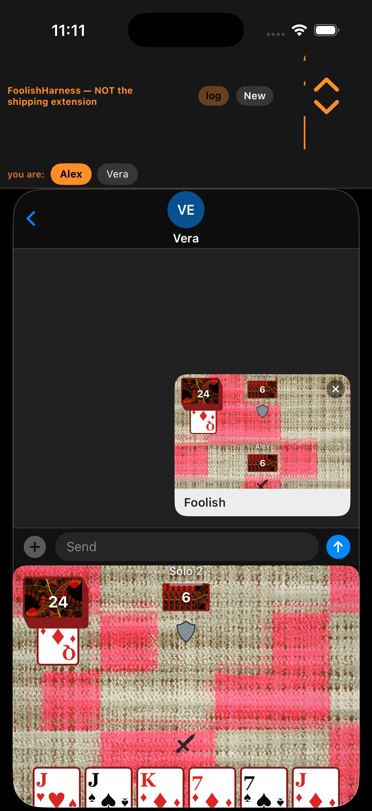

---

### 7. MINOR — "nickname too long" gives no target length and does not cap input
**Screen/state:** New game / nickname entry.
**Observed:** Typing a long nickname disables the action button and relabels it `nickname too long` (good, clear that something is wrong). But the field keeps accepting unlimited characters, the tail scrolls off, and nothing tells the user the actual maximum or how many characters to remove.
**Why it matters:** This is an improvement over the prior review's name-cap blocker (validation now exists), but the UX is guess-and-check. Minor.
**Repro:** New game → type a ~50-char nickname.

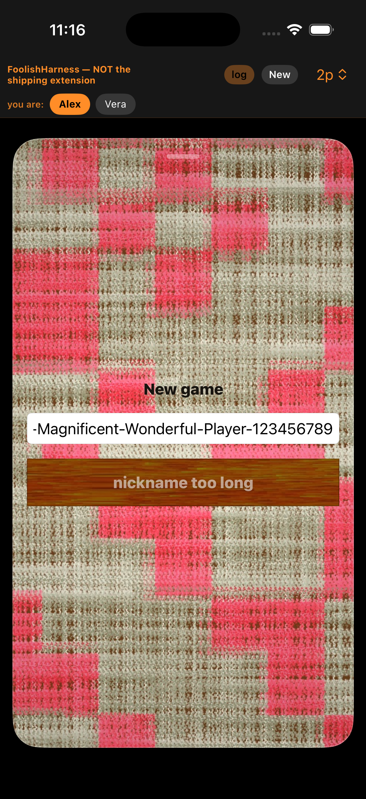

Normal case, for contrast (button enables and reads "Create game"):

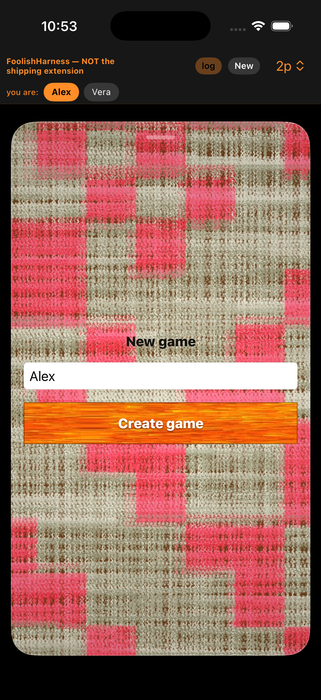

---

### 8. MINOR — iMessage app-list icon is dark and muddy
**Screen/state:** Messages "+" app list (the real extension's list-row icon).
**Observed:** The Foolish entry uses a jester emblem on a dark maroon tile. At app-list size the jester detail is hard to make out and the tile reads as a dark red blob next to Apple's brighter, higher-contrast icons (Camera, Photos, Stickers, Apple Cash).
**Why it matters:** Icon legibility/branding in the one place users pick the app. Minor but it is the app's storefront within Messages.
**Repro:** Messages → conversation → "+" → scroll to Foolish.

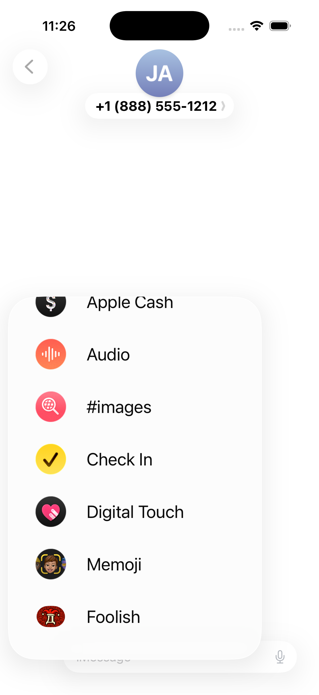

---

### 9. NIT — "Add player (testing)" stays tappable after the lobby is full
**Screen/state:** Lobby (harness path).
**Observed:** With 6/6 players seated, the `Add player (testing)` button is still shown and tappable, seemingly allowing a 7th seat beyond the selected cap.
**Why it matters:** This is a **harness-only** testing affordance and won't ship, so it is informational. If any similar "add" path exists in the real join flow, it should hard-stop at the player cap.
**Repro:** New game → 6p → add 5 players → button still present.

---

### 10. NIT / context — Real extension confirmed representative; landscape reflows but is irrelevant
**Screen/state:** Real iMessage extension (compact) + landscape.
**Observed:** Launching the actual extension in Messages shows the identical "New game" nickname UI and pink background as the harness, confirming the harness faithfully represents shipping (so findings above apply to the real app). Separately, rotating to landscape reflows without crashing but is not laid out for landscape (large empty margins); iMessage runs portrait, so this is low priority.
**Why it matters:** Validates the review; landscape is a non-issue for an iMessage app.

Real extension, compact presentation inside Messages:

Landscape (capture is rotated 90°; app reflowed without breakage):

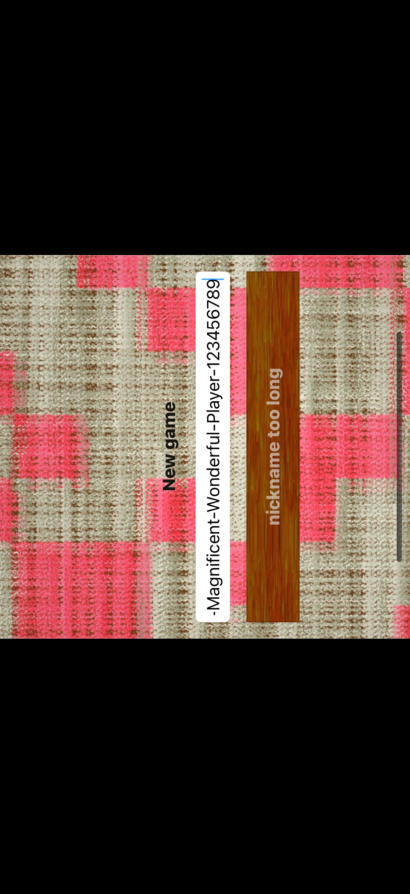

---

## What I could NOT test, and why

- **A full bout: attacking, covering, passing, taking, and the bout-end sweep animation.** The harness's added opponents are **Solo bots that never take their turn** (waited 12s+, no move), and the named harness identities (Vera, Boris, …) each get an **independent game** rather than joining mine, so I could not hand turns back and forth. When it was my turn to attack, synthetic tap/drag via `cliclick` did not register as a card play (SwiftUI's drag gesture appears not to accept the synthetic touch sequence; earlier illegal-move toasts came through, but a legal placement never did). I therefore could not exercise cover/take/pass or the sweep.
- **Game-over / win / loss screen.** Requires completing a game, which the above blocks.
- **Leaderboard / score screen.** Never reached — it appears to be tied to game completion. The prior review's "leaderboard walks off screen" blocker is therefore **still unverified** and should be re-checked once a game can be finished.
- **A 15-20 card, two-row hand.** A hand only grows that large by taking cards across multiple bouts, which requires playable turns.
- **"Waiting for opponent" affordance.** I could see the static waiting state but not any spinner/animation that would appear while a real opponent moves.
- **The sticker-browser (full-screen app picker) icon presentation and any App Store metadata/screenshots.** I captured the "+" app-list icon (finding 8); the large sticker-browser tile and store listing were out of scope for a Simulator run.
- **Non-UI store requirements** (armv7/arm64 slices, privacy manifest, entitlements) — not observable from the running UI.

**Positive notes:** No crashes or hangs in any state; rapid tapping, rotation, largest Dynamic Type, and a 50-char nickname were all handled gracefully; nickname length is now validated (prior blocker improved); text labels honor Dynamic Type; the illegal-move toast is clear.
